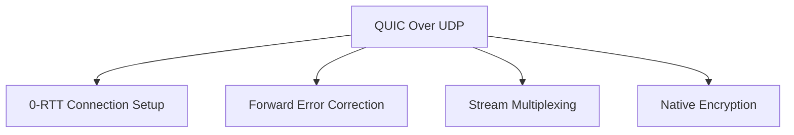
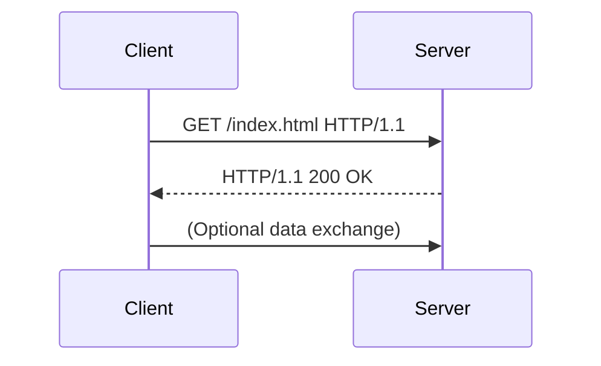
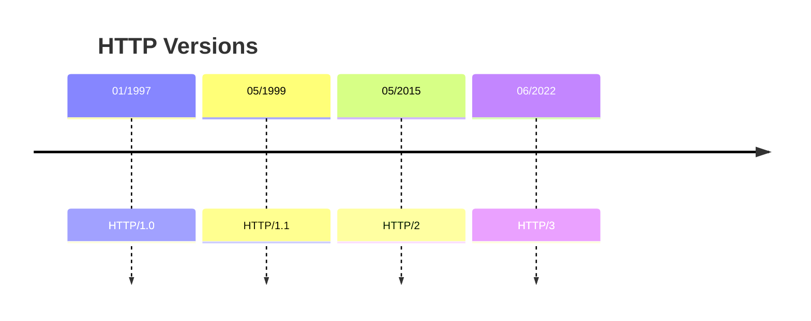

# Networking
- Fundementals
- Socket Programming
- Asynchronious I/O

---
 
 ## Network


*https://www.oreilly.com/library/view/linux-networking-cookbook/9780596102487/ch01.html* 

---

## Linux Network Commands

```bash
# Check listening ports
sudo netstat -tulpn

# Monitor network activity
tcpdump -i eth0

# Query DNS
dig example.com

# Transfer files
curl -O http://example.com/file.txt
```

https://linuxhint.com/basic_linux_network_commands/
https://mindmajix.com/linux-networking-commands-best-examples

---

## Types of computer networking
<table style="width:100%; border-collapse: collapse;">
  <tr>
    <td style="width:50%; padding:10px; vertical-align:top;">
      <h4>P2P Network</h4>
      
      <p>Decentralized architecture with direct peer connections</p>
    </td>
    <td style="width:50%; padding:10px; vertical-align:top;">
      <h4>Client-Server Model</h4>
      
      <p>Centralized architecture with dedicated server infrastructure</p>
    </td>
  </tr>
</table>

## Communication


---

## Conceptual Layering of Network Architecture


*Successful communication requires a protocol(an agreement mechanism) on every layer of the systems*

---

## TCP/IP model


[OSI model(conceptual not used)](https://en.wikipedia.org/wiki/OSI_model)
[Internet protocol suite](https://en.wikipedia.org/wiki/Internet_protocol_suite)

---

## Network Packet: Internet protocol suite (TCP/IP model)

<table style="width:100%; border-collapse: collapse; min-width:600px;">
  <tr>
    <td style="width:50%; padding:15px; vertical-align:top;">
      <a href="https://en.wikipedia.org/wiki/Internet_protocol_suite" target="_blank">
        
      </a>
      <p style="margin-top:8px;">TCP/IP protocol suite showing layer interactions</p>
    </td>
    <td style="width:50%; padding:15px; vertical-align:top;">
      <a href="https://en.wikipedia.org/wiki/Internet_protocol_suite" target="_blank">
        
      </a>
      <p style="margin-top:8px;">Data encapsulation process in UDP communication</p>
    </td>
  </tr>
</table>

[Internet protocol suite](https://en.wikipedia.org/wiki/Internet_protocol_suite)

---

## Internet Layer: IP (v4-v6)

IP has the task of delivering packets from the source host to the destination host solely based on the IP addresses in the packet headers. 

- Packets must contain an IP address of its destination

- Packets are handled and delivered independently

- Packets may lost, reordered or duplicated


## Port Numers
Both TCP and UDP use port numbers  
application-specific construct serving as a communication endpoint  
16-bit unsigned integer, thus ranging from 0 to 65535) to provide end-to-end transport

---
---

$ lsof -i -P -n
COMMAND  PID      USER   FD   TYPE DEVICE SIZE/OFF NODE NAME
firefox 6636 ad_public  177u  IPv4 170052      0t0  TCP 10.5.1.74:35684->34.120.208.123:443 (ESTABLISHED)
firefox 6636 ad_public  189u  IPv4 170051      0t0  TCP 10.5.1.74:34326->34.149.100.209:443 (ESTABLISHED)
firefox 6636 ad_public  194u  IPv4 158123      0t0  TCP 10.5.1.74:51238->172.66.41.27:443 (ESTABLISHED)
chrome  8471 ad_public  234u  IPv4  33288      0t0  UDP 224.0.0.251:5353 
chrome  8518 ad_public   35u  IPv4   3910      0t0  TCP 10.5.1.74:45734->95.183.223.253:443 (ESTABLISHED)
$ sudo netstat -tulpn
Proto Recv-Q Send-Q Local Address           Foreign Address         State       PID/Program name    
tcp        0      0 127.0.0.1:3306          0.0.0.0:*               LISTEN      1531/mysqld         

---

## Transport Layer: TCP vs UDP vs QUIC

---

## Application Layer Protocols
HTTP, HTTPs, Websockets
Websockets, HTTP, HTTPS
always run WebSocket, HTTP over Transport Layer Security - Wikipedia
https://en.wikipedia.org/wiki/Transport_Layer_Security

HTTPs, wss ( “secure” websocket)
The WebSocket API (WebSockets) - Web APIs | MDN 
https://developer.mozilla.org/en-US/docs/Web/API/WebSockets_API#guides

---

## HTTP overview
https://developer.mozilla.org/en-US/docs/Web/HTTP/Overview

https://en.wikipedia.org/wiki/HTTP/3


# Networking Fundamentals: Layers, Protocols, and Modern Trends

---

## Internet Layer: IP (IPv4 vs IPv6)

### Core Functionality
IP handles **end-to-end packet delivery** based on destination IP addresses:
- Packets are routed independently
- No guarantees for order, delivery, or duplication prevention
- IPv4 (32-bit) vs IPv6 (128-bit) addressing
- 
---


---

### IPv4 vs IPv6 Header Comparison
<div style="display:flex; gap:20px;">
  
  
</div>

---

### Current Trends
1. **IPv6 Adoption**: Global adoption ~35% (Google data), with ISPs and mobile networks leading
2. **Tunneling Protocols**: IPv6-in-IPv4 tunnels for transitional networks
3. **Cloud Infrastructure**: AWS/GCP require IPv6 for new deployments
4. **IoT Growth**: IPv6 essential for unique device addressing

---

## Port Numbers

### Key Concepts
- 16-bit unsigned integers (0-65535)
- **Well-known ports**: 0-1023 (HTTP:80, HTTPS:443)
- **Ephemeral ports**: 49152-65535 (temporary client ports)

---

### Example Output Analysis
```bash
$ lsof -i -P -n
COMMAND   PID       USER   FD   TYPE DEVICE SIZE/OFF NODE NAME
firefox  6636   ad_public  177u  IPv4 170052      0t0  TCP 10.5.1.74:35684->34.120.208.123:443
chrome   8471   ad_public  234u  IPv4  33288      0t0  UDP 224.0.0.251:5353 
```
---

## Transport Layer: TCP vs UDP vs QUIC

### Protocol Comparison Matrix

| Feature            | TCP                          | UDP                          | QUIC                          |
|--------------------|------------------------------|------------------------------|-------------------------------|
| Connection Type    | Connection-oriented          | Connectionless               | Connectionless (0-RTT handshake)|
| Reliability        | Guaranteed delivery          | Best-effort                  | Forward Error Correction      |
| Congestion Control | Built-in                     | None                         | Built-in (BBR, Cubic)         |
| Security           | TLS over TCP                 | Manual encryption            | TLS 1.3 integrated            |
| Multiplexing       | Single stream                | Single datagram              | Multiple streams in one connection |
| Use Cases          | Web, Email, File Transfer    | Streaming, Gaming            | HTTP/3, Low-latency services  |

---

### QUIC Advantages


---

### Current Trends
1. **HTTP/3 Adoption**: 25% of top websites (W3Techs)
2. **CDN Integration**: Cloudflare, AWS use QUIC for performance
3. **IoT Optimization**: UDP-based protocols for low-power devices
4. **5G Networks**: UDP/IP preferred for latency-sensitive apps

---

## Application Layer Protocols

### Web Technologies Stack
```mermaid
graph TD
    A[HTTP/3] --> B[QUIC]
    A --> C[TLS 1.3]
    D[HTTP/2] --> E[TCP]
    D --> F[TLS 1.2]
    G[WebSocket] --> H[TCP]
    H --> I[TLS (wss://)]
```

---

### HTTP Request Lifecycle


---

### WebSocket Handshake
```http
GET /chat HTTP/1.1
Upgrade: websocket
Connection: Upgrade
Sec-WebSocket-Key: x3JJHMbDL1EzLkh9GBhXDw==
Sec-WebSocket-Version: 13

HTTP/1.1 101 Switching Protocols
Upgrade: websocket
Connection: Upgrade
Sec-WebSocket-Accept: HSmrc0sMlYUkAGmm5OPpG2HaGWk=
```

### Current Trends
1. **HTTP/3 Deployment**: Major sites like Google, Facebook use QUIC
2. **gRPC**: HTTP/2-based RPC framework for microservices
3. **Edge Computing**: WebSockets for real-time edge-cloud communication
4. **TLS 1.3**: 70%+ TLS connections now use TLS 1.3

---

## HTTP Evolution Timeline




### QUIC vs TCP Handshake
<div style="display:flex; gap:20px;">
  
</div>

---

## Industry Adoption Trends (2023-2024)

| Technology          | Adoption Rate | Key Drivers                     |
|---------------------|---------------|---------------------------------|
| IPv6                | 35% global    | IoT growth, ISP requirements    |
| QUIC/HTTP/3         | 25% top sites | Video streaming, low latency    |
| TLS 1.3             | 70% TLS       | Security mandates               |
| WebSockets          | 80% SPAs      | Real-time web apps              |
| UDP-based Protocols | 60% gaming    | Latency-sensitive applications  |

---

## References
- [MDN HTTP Guide](https://developer.mozilla.org/en-US/docs/Web/HTTP/Overview)
- [Wikipedia Transport Layer Security](https://en.wikipedia.org/wiki/Transport_Layer_Security)
- [QUIC Protocol Spec](https://www.rfc-editor.org/rfc/rfc9000)
- [IPv6 Adoption Statistics](https://www.google.com/intl/en/ipv6/statistics.html)

