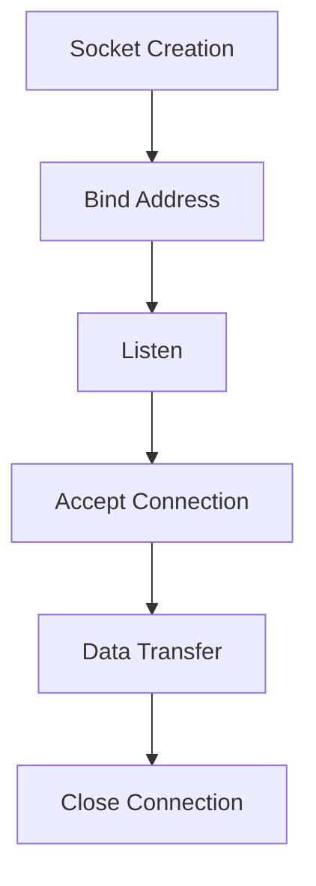
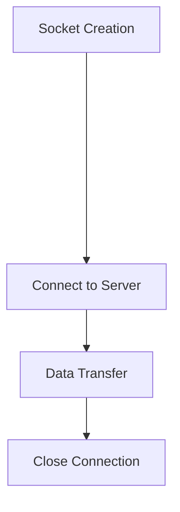
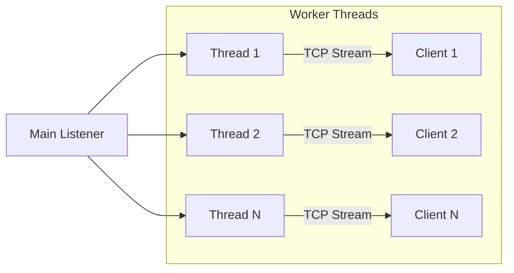

# Sockets Programming
Sockets (Berkeley Sockets) are Application Programming Interfaces (API) 
* Sockets are not protocol
* We will see socket programming
  * That uses UDP
  * That uses TCP
  - And see kernel implementation of Transport Layer Security(TLS) encryption protocol over TCP 
  - OpenSSL
https://www.kernel.org/doc/html/latest/networking/tls.html


### Socket API Overview
```c
#include <sys/socket.h>
int socket(int domain, int type, int protocol);
```
---

#### Socket Structures
```c
// IPv4 Socket Address Structure
struct sockaddr_in {
    sa_family_t     sin_family;     /* AF_INET */
    in_port_t       sin_port;       /* Port number */
    struct in_addr  sin_addr;       /* IPv4 address */
};
```

---

```c
// UNIX Domain Socket Structure
struct sockaddr_un {
    sa_family_t     sun_family;     /* AF_UNIX */
    char            sun_path[];     /* Socket pathname */
};
```

---

<table>
<tr>
<th>Server Workflow</th>
<th>Client Workflow</th>
</tr>
<tr>
<td width="20%">


</td>

<td width="20%">


</td>
</tr>
</table>

---

### Server Code Breakdown
1. **Create & Configure Socket** Create an end point.
```c
int sfd = socket(AF_INET, SOCK_STREAM, IPPROTO_TCP);

struct sockaddr_in addr = {
  .sin_family = AF_INET,
  .sin_port = htons(5100),
  .sin_addr.s_addr = INADDR_ANY
};
```

2. **Bind & Listen** Associate address and listen
```c
bind(sfd, (struct sockaddr*)&addr, sizeof(addr));
listen(sfd, 10);
```

---

**Client Side Socket**

1. **Create Socket**
```c
int sfd = socket(AF_INET, SOCK_STREAM, IPPROTO_TCP);
```

1. **Connect**
```c
struct sockaddr_in srv_addr = {
  .sin_family = AF_INET,
  .sin_port = htons(5100), //server port
  .sin_addr.s_addr = inet_addr("127.0.0.1")//server address
};
connect(sfd, (struct sockaddr*)&srv_addr, sizeof(srv_addr));
```

---

3. **Server Accept Connection**
```c
int client_fd = accept(sfd, NULL, NULL);
```

---

4. **Server: Data Exchange**
```c
recv(client_fd, buffer, 1024, 0);
send(client_fd, "Response", 8, 0);
```


3. **Client: Data Exchange**
```c
send(sfd, "Hello", 5, 0);
recv(sfd, buffer, 1024, 0);
```

---

4. **Terminate**
```c
close(client_fd);//in server only
close(sfd);
```


---

### Server Implementation
```c
#include <sys/socket.h>
#include <netinet/in.h>
#include <stdio.h>

#define PORT 5100

int main() {
    struct sockaddr_in server_addr;
    server_addr.sin_family = AF_INET;
    server_addr.sin_port = htons(PORT);
    server_addr.sin_addr.s_addr = htonl(INADDR_ANY);

    int sfd = socket(AF_INET, SOCK_STREAM, 0);

    bind(sfd, (struct sockaddr *)&server_addr, sizeof(server_addr));

    listen(sfd, 10);

    int client_fd = accept(sfd, NULL, NULL);
    char buffer[256] = {0};

    read(client_fd, buffer, sizeof(buffer));
    printf("Received: %s\n", buffer);
    send(client_fd, "Hello from server", 17, 0);
}
```

---

### Client Implementation
```c
#include <sys/socket.h>
#include <netinet/in.h>
#include <stdio.h>

#define PORT 5100

int main() {
    struct sockaddr_in server_addr;
    server_addr.sin_family = AF_INET;
    server_addr.sin_port = htons(PORT);
    inet_pton(AF_INET, "127.0.0.1", &server_addr.sin_addr);

    int sfd = socket(AF_INET, SOCK_STREAM, 0);
    connect(sfd, (struct sockaddr *)&server_addr, sizeof(server_addr));
    send(sfd, "Hello from client", 17, 0);
    
    char buffer[256] = {0};
    read(sfd, buffer, sizeof(buffer));
    printf("Response: %s\n", buffer);
}
```

---


### Communication Flow
```
Client          Server
  |                |
  |-- SYN ------->|
  |<-SYN-ACK----- |
  |-- ACK ------->|
  |                |
  |<-Data---------|
  |----ACK------->|
  |                |
```

---

## Application Layer Protocols

### HTTP Request/Response
```http
GET / HTTP/1.1
Host: www.example.com
User-Agent: Mozilla/5.0
```

```http
HTTP/1.1 200 OK
Date: Mon, 23 May 2005 22:38:34 GMT
Content-Type: text/html
Content-Length: 155

<html>
  <body>Hello World</body>
</html>
```

---

### WebSocket vs HTTP
- **WebSocket**: Persistent connection, bidirectional communication
- **HTTP**: Request-response model, stateless

```
WebSocket Handshake:
Client: GET /chat HTTP/1.1
        Upgrade: websocket
        Connection: Upgrade

Server: HTTP/1.1 101 Switching Protocols
        Upgrade: websocket
        Connection: Upgrade
```

---

### Data Formats
**XML Example**
```xml
<part number="1976">
  <name>Windscreen Wiper</name>
</part>
```

**JSON Example**
```json
{"name": "John", "age": 30, "car": null}
```

---

## Security Considerations
- **TLS/SSL**: Encryption at Transport Layer
- **Authentication**: OAuth, SAML, OpenID
- **Access Control**: Role-based permissions

---

# Socket Programming Deep Dive

## Table of Contents
2. [Concurrency Models](#concurrency-models)
3. [Asynchronous I/O Techniques](#asynchronous-io-techniques)
4. [Code Patterns](#code-patterns)

---

## Concurrency Models

### Multithreaded Server Architecture


---

**Implementation Example:**
```c
void *client_handler(void *arg) {
    int client_fd = *(int*)arg;
    char buffer[256];
    recv(client_fd, buffer, sizeof(buffer), 0);
    // Process request...
    close(client_fd);
    return NULL;
}

// In main loop:
pthread_t thread_id;
pthread_create(&thread_id, NULL, client_handler, &client_fd);
```

---

### Process-based Approach
```c
if(fork() == 0) {  // Child process
    handle_client(client_fd);
    exit(0);       // Terminate child
}
close(client_fd);  // Parent closes copy
```

---

## Asynchronous I/O Techniques

### Non-blocking Socket Setup
```c
// Method 1: Flag at creation
int sockfd = socket(AF_INET, SOCK_STREAM | SOCK_NONBLOCK, 0);

// Method 2: fcntl modification
int flags = fcntl(sockfd, F_GETFL, 0);
fcntl(sockfd, F_SETFL, flags | O_NONBLOCK);
```

---

### I/O Multiplexing with `select()`
```c
fd_set read_fds;
FD_ZERO(&read_fds);
FD_SET(sockfd, &read_fds);

if (select(sockfd + 1, &read_fds, NULL, NULL, &timeout) > 0) {
    if (FD_ISSET(sockfd, &read_fds)) {
        // Handle incoming connection
    }
}
```

---

### Event-driven with `epoll` (Linux)
```c
int epfd = epoll_create1(0);
struct epoll_event event, events[MAX_EVENTS];

event.events = EPOLLIN | EPOLLET;
event.data.fd = sockfd;
epoll_ctl(epfd, EPOLL_CTL_ADD, sockfd, &event);

while(1) {
    int nfds = epoll_wait(epfd, events, MAX_EVENTS, -1);
    for(int i=0; i < nfds; i++) {
        if(events[i].data.fd == sockfd) {
            // Handle new connection
        }
    }
}
```

---

### Signal-Driven I/O
```c
// Enable SIGIO generation
fcntl(sockfd, F_SETOWN, getpid());
int flags = fcntl(sockfd, F_GETFL);
fcntl(sockfd, F_SETFL, flags | O_ASYNC);

// Signal handler registration
signal(SIGIO, sigio_handler);

// Handler implementation
void sigio_handler(int signo) {
    // Process I/O event
}
```

---

## Code Patterns

### TCP Echo Server Skeleton
```c
#include <sys/socket.h>
#include <netinet/in.h>

#define PORT 8080

int main() {
    int sockfd = socket(AF_INET, SOCK_STREAM, 0);
    struct sockaddr_in addr = {
        .sin_family = AF_INET,
        .sin_port = htons(PORT),
        .sin_addr.s_addr = INADDR_ANY
    };

    bind(sockfd, (struct sockaddr *)&addr, sizeof(addr));
    listen(sockfd, 5);

    while(1) {
        int client_fd = accept(sockfd, NULL, NULL);
        if(fork() == 0) {
            char buffer[1024];
            int bytes = recv(client_fd, buffer, sizeof(buffer), 0);
            send(client_fd, buffer, bytes, 0);
            close(client_fd);
            exit(0);
        }
        close(client_fd);
    }
}
```
---

### UDP Datagram Server
```c
int sockfd = socket(AF_INET, SOCK_DGRAM, 0);
struct sockaddr_in server_addr = {
    .sin_family = AF_INET,
    .sin_port = htons(PORT),
    .sin_addr.s_addr = INADDR_ANY
};

bind(sockfd, (struct sockaddr *)&server_addr, sizeof(server_addr));

char buffer[1024];
struct sockaddr_in client_addr;
socklen_t len = sizeof(client_addr);

while(1) {
    int n = recvfrom(sockfd, buffer, sizeof(buffer), 0, 
                    (struct sockaddr *)&client_addr, &len);
    sendto(sockfd, buffer, n, 0, 
          (struct sockaddr *)&client_addr, len);
}
```

---

## Comparison Matrix

| Technique        | Throughput | Scalability | Complexity | Use Case               |
|------------------|-----------|-------------|------------|------------------------|
| Blocking         | Low       | Low         | Simple     | Simple services        |
| Multithreaded    | Medium    | Medium      | Moderate   | CPU-bound workloads    |
| Async I/O        | High      | High        | Complex    | High-performance apps  |
| Event-driven     | Very High | Very High   | Advanced   | Web servers            |

---

## Best Practices
1. Always check return values:
```c
if (bind(sockfd, ...) == -1) {
    perror("Bind failed");
    exit(EXIT_FAILURE);
}
```

2. Use `htons()`/`ntohl()` for network byte order
3. Implement proper error handling in signal handlers
4. Limit concurrent connections with backlog queues
5. Clean up resources with `close()`
6. Use `SO_REUSEADDR` for quick port reuse:
```c
int opt = 1;
setsockopt(sockfd, SOL_SOCKET, SO_REUSEADDR, &opt, sizeof(opt));
```

---

**Current Best Practices:**
1. Use non-blocking sockets with `epoll`/`kqueue` for high-performance servers
2. Implement proper error handling and timeout mechanisms
3. Use asynchronous I/O for scalable network applications
4. Prefer IPv6-ready implementations with IPv4 fallback
5. Integrate TLS 1.3 for secure communications
6. Implement connection pooling for frequent client interactions

---

[Complete Tutorial PDF](https://www.csd.uoc.gr/~hy556/material/tutorials/cs556-3rd-tutorial.pdf)  
[Advanced Linux Socket Programming](https://www.kernel.org/doc/html/latest/networking/tls.html)