# 🚦 Signals & Event-Driven Programming  

---

## 🎮 Event-Driven Programming (EDP)

### Two Programming Paradigms
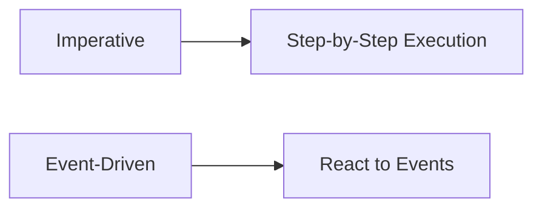

- **Traditional Approach**: Code runs top-to-bottom  
- **EDP**: Program sleeps until **events** occur  
- 🔑 Key Concept: *Inversion of Control*

---

## 🖥️ Java Swing Example

### Event Handling Components
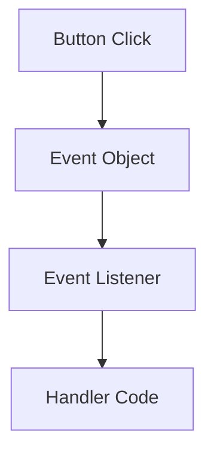

**Key Terms**:
- 📩 Event Source (e.g., JButton)
- 👂 Event Listener (implements ActionListener)
- 🎚️ Event Loop (Managed by GUI Thread)

---

## 🧑💻 Java Code Breakdown

```java
// 🎯 Event Handler 1: Modify Button Text
class TextChanger implements ActionListener {
    @Override
    public void actionPerformed(ActionEvent e) {
        JButton btn = (JButton)e.getSource();
        btn.setText("Clicked!");  // 🖱️ Update UI
    }
}

// 🔔 Event Handler 2: Log to Console
class Logger implements ActionListener {
    @Override
    public void actionPerformed(ActionEvent e) {
        System.out.println("Event detected!");  // 📝 Logging
    }
}
```

---

## 🧩 Event Registration

```java
public static void main(String[] args) {
    JButton button = new JButton("Click Me!");
    button.addActionListener(new TextChanger());  // 🏗️ Add 1st handler
    button.addActionListener(new Logger());       // ➕ Add 2nd handler
    
    // 🖼️ GUI Setup
    JFrame frame = new JFrame();
    frame.add(button);
    frame.setVisible(true);
}
```

💡 **Multiple Handlers**: Both execute on same event!

---

## ⚡ Signals: Process-Level Events

### UNIX Signal Basics
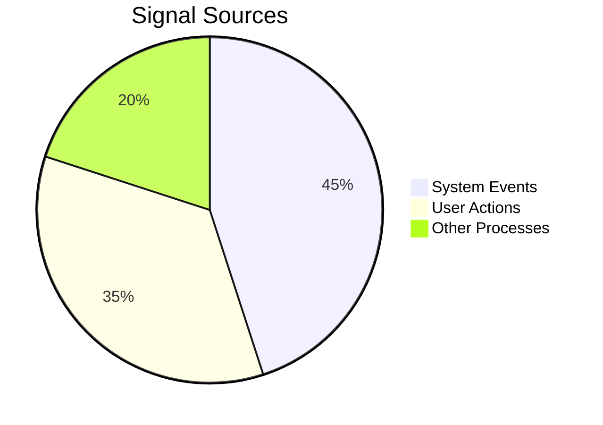

- **Signal**: Software interrupt delivered to process  
- 📨 Examples: SIGINT (Ctrl-C), SIGSEGV (Segfault), SIGKILL

---

## 📟 Common UNIX Signals

| Signal   | Value     | Action    | Description           |
|----------|-----------|-----------|-----------------------|
| SIGINT   | 2         | Terminate | Keyboard interrupt    |
| SIGKILL  | 9         | Terminate | Forceful kill         |
| SIGSTOP  | 17,19,23  | Stop      | Pause process         |
| SIGCONT  | 19,18,25  | Continue  | Resume stopped process|

🔔 **Important**: SIGKILL cannot be caught or ignored!

---

## 🖥️ Signal Generation Demo

**Terminal Session**:
```bash
$ ./myprogram &  # 🏃 Run in background
[1] 1234

$ kill -SIGSTOP 1234  # ⏸️ Freeze process
$ kill -SIGCONT 1234  # ▶️ Resume process
$ kill -9 1234        # ☠️ Force kill
```

**C Program**:
```c
printf("My PID: %d\n", getpid());  // 📟 Display process ID
while(1) { /*...*/ }  // ♾️ Infinite loop for testing
```

---

## 🚨 Signal Handling Challenges

### The Reentrancy Problem
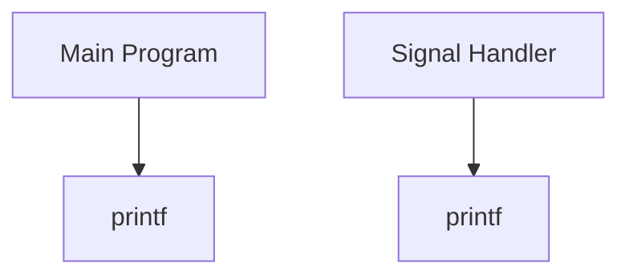

⚠️ **Danger**: Both contexts using same non-reentrant function!

---

## 🛡️ Safe Signal Handling

### Golden Rules:
1. 🚫 Never use complex I/O in handlers
2. 🔌 Keep handlers simple (flag setting only)
3. 🔄 Use **volatile** variables

```c
volatile sig_atomic_t emergency_flag = 0;

void handler(int sig) {
    emergency_flag = 1;  // 🚩 Safe!
}
```

---

## 🔄 Signal Handling Flow

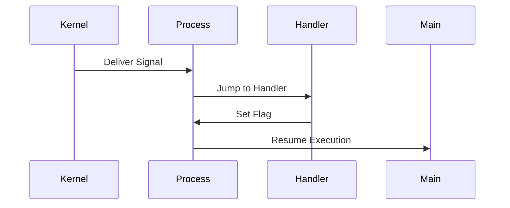

💡 **Key Insight**: Handler execution pauses normal program flow!

---

## 🛠️ Signal Management Tools

### Comparison: signal() vs sigaction()
| Feature        | signal() | sigaction() |
|----------------|----------|-------------|
| Portability    | ❌       | ✅          |
| Restart Support| ❌       | ✅          |
| Signal Masking | ❌       | ✅          |

🔧 **Best Practice**: Always use `sigaction()` for production code!

---

## 🧰 sigaction() in Action

```c
struct sigaction sa;
sa.sa_handler = graceful_exit;  // 🎯 Set handler
sigemptyset(&sa.sa_mask);       // 🚫 Block no signals during handler
sa.sa_flags = SA_RESTART;       // 🔄 Restart interrupted syscalls

sigaction(SIGTERM, &sa, NULL);  // 💾 Register handler
```

⚙️ **Flags**:  
- SA_RESTART: Auto-restart system calls  
- SA_NOCLDSTOP: Ignore child stop signals  

---

## 🛑 Blocking Signals

### Why Block?
- 🚧 Critical sections
- 🛡️ Prevent signal storms

```c
sigset_t block_set;
sigemptyset(&block_set);
sigaddset(&block_set, SIGINT);  // 🚫 Block Ctrl-C

// 🔒 Apply to current thread
sigprocmask(SIG_BLOCK, &block_set, NULL); 
```

---

## 🔄 Signal Mask Lifecycle

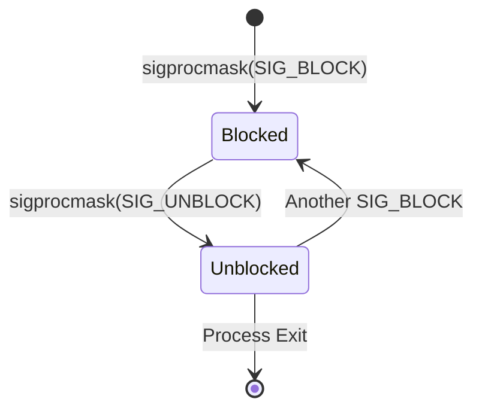

📌 **Remember**: Masks are inherited across fork()!

---

## 📚 Part 1 Summary

1. 🎮 EDP: React to events rather than sequential execution  
2. ⚡ Signals: Process-level interrupts with predefined meanings  
3. 🛡️ Safety: Avoid async-unsafe functions in handlers  
4. 🔧 Management: Prefer sigaction() over signal()  
5. 🚧 Blocking: Control when signals are processed  

➡️ **Next**: Signal Handling in Multithreaded Programs!

---

# 🧵 Signals in Threads & Advanced Patterns  

---

## 🧶 Multithreaded Signal Handling

### Key Challenges
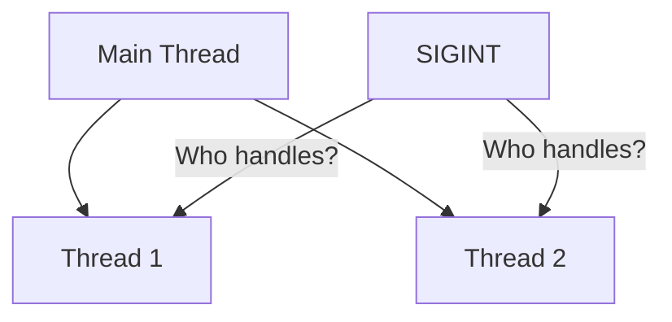

- 🌐 **Shared Disposition**: Signal handlers are *process-wide*
- 🎭 **Per-Thread Masks**: Each thread can filter signals independently
- ☠️ **SIGKILL/SIGSTOP**: Always affect entire process

---

## 🛡️ Thread Signal Protection

### pthread_sigmask Pattern
```c
sigset_t mask;
sigemptyset(&mask);
sigaddset(&mask, SIGINT);  // 🚫 Block Ctrl-C

// 🔒 Apply to ALL threads created after this
pthread_sigmask(SIG_BLOCK, &mask, NULL); 

pthread_create(&tid, NULL, worker_thread, NULL);  // 🧵 New thread
```

💡 **Pro Tip**: Set masks in main() before spawning threads!

---

## 📨 Sending Signals to Threads

### Targeted Delivery with pthread_kill
```c
void* worker(void* arg) {
    // 🔕 This thread ignores SIGUSR1
    signal(SIGUSR1, SIG_IGN);
    /* ... */
}

int main() {
    pthread_t tid;
    pthread_create(&tid, NULL, worker, NULL);
    
    // 💌 Send signal to specific thread
    pthread_kill(tid, SIGUSR1);  // ❗ Still ignored!
}
```

⚠️ **Warning**: `pthread_kill(tid, SIGKILL)` terminates entire process!

---

## 👶 Child Process Signal Inheritance

### fork() Behavior
```mermaid
flowchart LR
    P[Parent] -->|fork()| C[Child]
    P[Signal Mask] --> C[Signal Mask]
    P[Signal Handlers] --> C[Signal Handlers]
```

**exec() Reset**:
- Handler reset to default for most signals
- Mask preserved

---

## 🚦 Signal Handling in fork()/exec()

### Common Pattern for Daemons
```c
if (fork() == 0) {  // 👶 Child
    setsid();  // 🔄 New session
    signal(SIGHUP, SIG_IGN);  // 🛡️ Immune to hangup
    
    execvp("./daemon", args);  // 🆕 New program
    // Default handlers restored except masked signals!
}
```

---

## 🔐 Signal Safety Deep Dive

### Async-Safe Functions (Partial List)
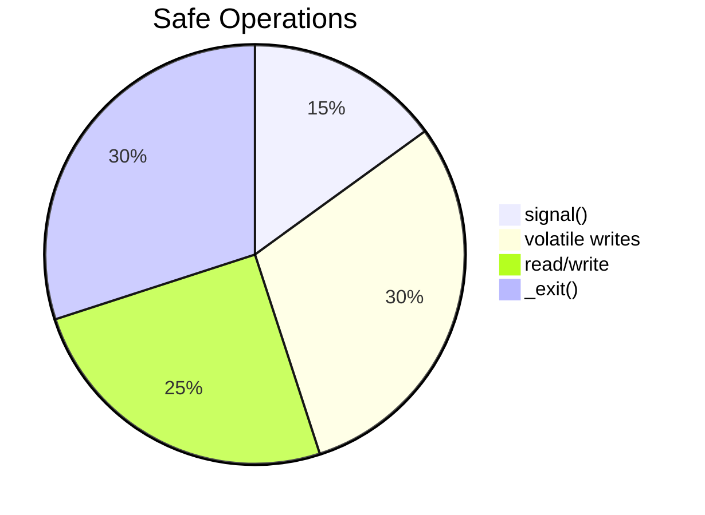

**Never Use**:
- ❌ malloc()
- ❌ printf()
- ❌ STL containers

---

## 🛠️ Advanced Signal Blocking

### Critical Section Protection
```c
void bank_transfer() {
    sigset_t old, block;
    sigfillset(&block);  // 🚧 Block everything
    
    // 🔒 Enter critical section
    pthread_sigmask(SIG_BLOCK, &block, &old);
    
    /* 💰 Modify shared account balance */
    
    // 🔓 Restore original mask
    pthread_sigmask(SIG_SETMASK, &old, NULL);
}
```

---

## 🌐 Process-Wide Signal Strategies

### Three Architectural Approaches
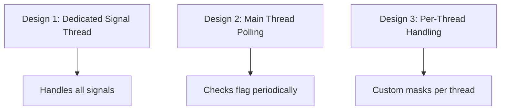

---

## 🧪 Real-World Example: Daemon Process

### Requirements
- 🛡️ Ignore terminal hangups (SIGHUP)
- 🔄 Reconfigure on SIGUSR1
- 📤 Graceful shutdown on SIGTERM

```c
void handler(int sig) {
    if (sig == SIGTERM) cleanup_and_exit();
    if (sig == SIGUSR1) reload_config();
}

int main() {
    signal(SIGHUP, SIG_IGN);  // 😎 Survive terminal close
    struct sigaction sa = {.sa_handler = handler};
    sigaction(SIGTERM, &sa, NULL);
    sigaction(SIGUSR1, &sa, NULL);
    
    while(1) { /*...*/ }
}
```

---

## 🚀 Signal Performance Tips

### Optimization Guide
| Scenario | Recommendation |
|----------|----------------|
💨 High-speed processing | 🛑 Block signals during bursts  
🔔 Frequent signals | ⏳ Use sigqueue() + SA_SIGINFO  
🕵️ Debugging | 📡 Use signalfd() (Linux)  

---

## ⚠️ Common Pitfalls

### "Gotcha!" List
1. 🔄 Forgetting SA_RESTART for slow syscalls
2. 📦 Using non-volatile flags in handlers
3. 🧵 Assuming thread-safe signal handlers
4. ⏱️ Relying on signal delivery timing

---

## 📚 Part 2 Summary

1. 🧵 Threads share handlers but have individual masks  
2. 👶 Child processes inherit masks but reset handlers on exec()  
3. 🛡️ Use pthread_sigmask for thread-level protection  
4. 🚧 Block signals during critical operations  
5. 🧪 Design signal handling early in architecture  

---

# 🤝 IPC Alternatives & Signal Best Practices  


---

## 🚫 Why Signals Are Limited

### IPC Requirement Spectrum
**"Communication Complexity"**
"Signals", "Pipes", "Sockets", "Shared Memory"

📌 Signals are at the low end - great for notifications, bad for data!

---

## 📡 Better IPC Alternatives

### Modern Options
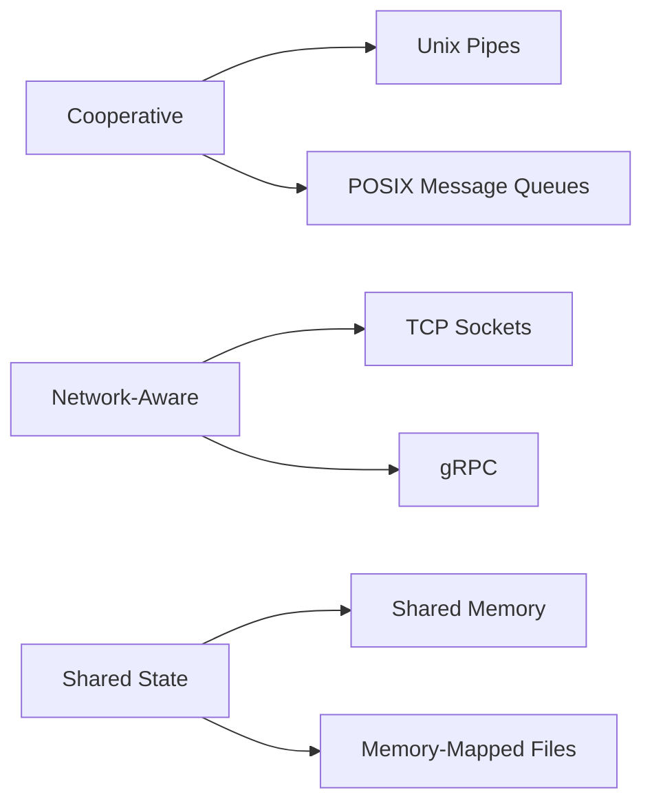

---

## 🔄 Signal vs Pipe Example

### Signal Approach (Fragile)
```c
// parent.c
kill(child_pid, SIG_DATA_READY);  // 📨 No payload!

// child.c
void handler(int sig) {
    // 🤷♀️ What data? Need to implement polling
}
```

### Pipe Approach (Robust)
```c
// parent.c
write(pipe_fd, &data, sizeof(data));  // 📦 Send payload

// child.c
read(pipe_fd, &data, sizeof(data));  // 🎯 Get exact data
```

---

## 🛠️ When to Use Signals

### Appropriate Use Cases
1. 🚨 Emergency shutdown (SIGTERM)
2. ⏸️ Process control (SIGSTOP/SIGCONT)
3. 📡 Simple notifications (SIGUSR1)
4. 🕵️ Debugging (SIGTRAP)

---

## 🏆 Signal Best Practices

### Golden Rules
1. 🎯 Keep handlers under 10 lines
2. 🚫 No mutexes/locks in handlers
3. 📡 Use signals as notifications only
4. 🔄 Combine with robust IPC for data
5. 🧪 Test under heavy load

---

## 🚀 Advanced: Real-Time Signals

### SIGRTMIN to SIGRTMAX Features
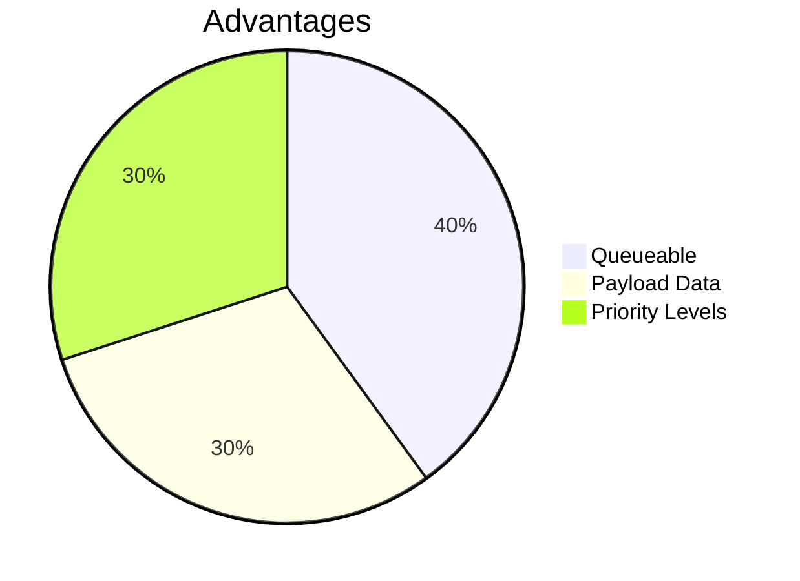

```c
union sigval value;
value.sival_int = 42;
sigqueue(pid, SIGRTMIN+5, value);  // 📨 Send with data
```

---

## 🔍 Signal Debugging Toolkit

### Essential Commands
```bash
strace -e trace=signal ./program  # 👀 Trace signals
kill -l                          # 📜 List all signals
gdb --ex "handle SIGINT nostop"  # 🐛 Debug without interception
```

---

## 🌐 Cross-Platform Considerations

### Portability Challenges
| Platform | Quirks |
|----------|--------|
Linux | Supports signalfd(), real-time signals  
Windows | Signals emulated via SEH  
macOS | Limited real-time signal support  

---

## 📚 Historical Perspective

### Evolution Timeline
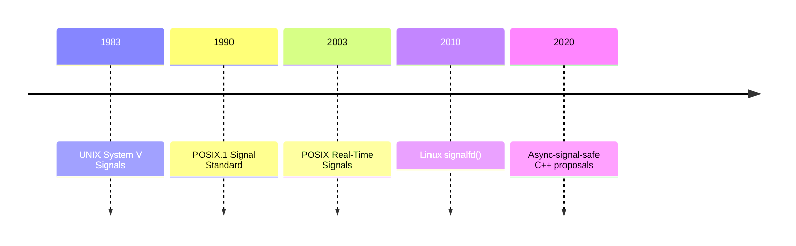

---

## 🧑🏫 Interactive Exercise

### Signal Simulation Lab
1. Write program that:
   - 🛑 Handles SIGINT to pause work
   - 🔄 Uses SIGCONT to resume
   - 📊 Tracks signal counts per type
2. Test with:
   ```bash
   kill -SIGINT PID  # ⏸️ Pause
   kill -SIGCONT PID # ▶️ Resume
   ```

---

## 📚 Complete Summary

1. ⚡ Signals = process-level interrupts  
2. 🧵 Thread handling requires careful masking  
3. 📡 Combine with IPC for robust systems  
4. 🛠️ Prefer modern APIs (sigaction, sigqueue)  
5. 🚀 Real-time signals enable queued payloads  

🎉 **Congratulations!** You've mastered UNIX signals!
