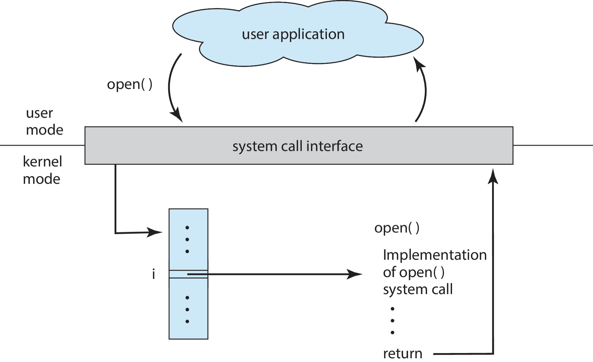
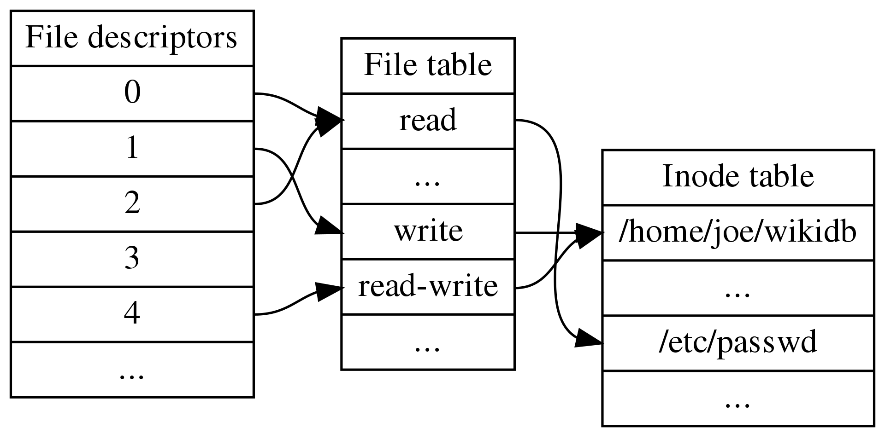

<style type="text/css">
div {
  font-size: clamp(10px, 3vw, 32px);
}
</style>

# FILE I/O & Process Management

- **Review of a system call**
- **File Descriptors**
- **Process Creation & Termination**
- **Example Shell Implementation**


---

## Review of a System Call

A **system call** is a request made by an active process **(through traps or software interrupts)** for a service performed by the kernel. 
- User processes cannot perform privileged operations directly and must request the OS via system calls.

**Examples**:
- Input/output operations (e.g., reading/writing files).
- Process creation/termination.
- Memory allocation.

[Full list of Linux system calls](https://man7.org/linux/man-pages/man2/syscalls.2.html)

---

## Why Do We Need a System Call?

**User Mode** → **Kernel Mode Transition**:
1. User process issues a system call (e.g., `open()`).
2. Transition to privileged kernel mode.
3. Kernel executes the requested operation.
4. Returns result to user mode.

**Diagram** (Simplified):
```
User Process → System Call → Kernel Mode (Privileged) → Return to User Mode
```

---

## Transition to Kernel Mode

Different CPU architectures use specific instructions to trigger kernel mode:

| Architecture | Instruction   | Syscall #Register | Return Value Registers | Notes              |
|--------------|---------------|--------------------|------------------------|--------------------|
| x86-32       | `int $0x80`   | `eax`              | `eax`, `edx`           | Legacy method      |
| x86-64       | `syscall`     | `rax`              | `rax`, `rdx`           | Modern 64-bit      |
| ARM (EABI)   | `swi 0x0`     | `r7`               | `r0`, `r1`             | ARM exception      |
| MIPS         | `syscall`     | `v0`               | `v0`, `v1`, `a3`       | MIPS convention    |

[https://man7.org/linux/man-pages/man2/syscall.2.html](https://man7.org/linux/man-pages/man2/syscall.2.html)

---

## System Call Example: Writing "Hello World" (x86-32 Assembly)

**C Code**:
```c
#include <unistd.h>
int main() {
    write(1, "Hello World\n", 12); // Write to stdout
    _exit(0); // Exit with code 0
}
```

**x86-32 Assembly**:
```assembly
_start:
    movl $4, %eax    ; Syscall #4 (write)
    movl $1, %ebx    ; stdout (fd=1)
    movl $msg, %ecx  ; Message address
    movl $12, %edx   ; Message length
    int $0x80         ; Trigger syscall

    movl $1, %eax    ; Syscall #1 (_exit)
    movl $0, %ebx    ; Exit code 0
    int $0x80         ; Trigger syscall
```

[https://en.wikipedia.org/wiki/X86_Assembly/Interfacing_with_Linux](https://en.wikipedia.org/wiki/X86_Assembly/Interfacing_with_Linux)

---

## System Call Example: Writing "Hello World" (x86-64 Assembly)

**C Code** (same as x86-32):
```c
#include <unistd.h>
int main() {
    write(1, "Hello World\n", 12);
    _exit(0);
}
```
**x86-64 Assembly**:
```assembly
_start:
    movq $1, %rax    ; Syscall #1 (write)
    movq $1, %rdi    ; stdout (fd=1)
    movq $msg, %rsi  ; Message address
    movq $12, %rdx   ; Message length
    syscall          ; Trigger syscall

    movq $60, %rax   ; Syscall #60 (_exit)
    movq $0, %rdi    ; Exit code 0
    syscall          ; Trigger syscall
```
[https://en.wikipedia.org/wiki/X86_Assembly/Interfacing_with_Linux](https://en.wikipedia.org/wiki/X86_Assembly/Interfacing_with_Linux)

---

## Direct System Calls Using `syscall()`
- Without Wrapper Functions

The `syscall()` function allows invoking system calls directly by their numeric ID.

**Syntax**:
```c
#include <sys/syscall.h>
long syscall(long number, ...); // Number = syscall ID
```

**Example**:
```c
#include <sys/syscall.h>
#include <unistd.h>

int main() {
    syscall(SYS_write, 1, "Hello\n", 6); // Direct write syscall
    return 0;
}
```

- Use `SYS_*` constants (e.g., `SYS_write`) for syscall IDs.

---

## Using `syscall()` for `sys_write`

**Kernel Definition**:
```c
// From Linux kernel source
sys_write(unsigned int fd, const char __user *buf, size_t count);
```

**User Code**:
```c
#include <sys/syscall.h>
#include <unistd.h>

int main() {
    char msg[] = "Hello, world!\n";
    syscall(SYS_write, 1, msg, 14); // Write 14 bytes to stdout
    return 0;
}
```
- `syscall(SYS_write, ...)` bypasses the `write()` wrapper function.

---

## API, System Calls, and OS Relationship

**Layers**:
1. **User Application**: Calls high-level API functions (e.g., `open()`).
2. **System Call Interface**: Translates API calls to kernel syscalls.
3. **Kernel**: Implements syscalls (e.g., `sys_open()`).

**Example**:
```
User App → `open()` → Syscall Interface → Kernel `sys_open()`
```

---

**Key Points**:
- APIs abstract syscall details.
- Syscalls are OS-specific and privileged.

---


*Diagram Source: Operating System Concepts, 10th Edition*

---

## `dup2()` System Call Implementation (x86)

**System Call Workflow**:
1. **Setup Parameters**: Load syscall number and arguments into registers.
2. **Trigger Kernel Mode**: Execute software interrupt (`int $0x80`).
3. **Kernel Handling**: Kernel processes the syscall and returns results.

---

**Assembly Example**:
```assembly
; dup2(fd, new_fd) implementation
movl $0x31, %eax    ; Syscall #63 (dup2)
movl 0x4(%esp), %ebx ; Source fd
movl 0x8(%esp), %ecx ; Target fd
int $0x80            ; Trigger syscall
```

**Kernel Entry Code** (Simplified):
```assembly
ENTRY(entry_INT80_32)
    SAVE_ALL         ; Save CPU state
    call do_int80_syscall_32 ; Execute syscall
    RESTORE_REGS     ; Restore state
    INTERRUPT_RETURN ; Return to user mode
```

[Reference](https://linux-kernel-labs.github.io/lectures/syscalls.html)

---

## Interrupts: Software vs Hardware

| **Type**              | **Description**                                                                 | **Examples**                     |
|-----------------------|---------------------------------------------------------------------------------|-----------------------------------|
| **Software Interrupt** | Signal to the kernel triggered by software (e.g., syscalls).                   | `int 0x80` (x86 syscall trigger) |
| **Hardware Interrupt** | Signal from hardware devices indicating an event needs immediate attention.     | Keyboard input, mouse movement   |

**Key Points**:
- Interrupt handlers process events.
- CPU resumes program execution after handling.

---

## Traps vs Exceptions vs Interrupts

| **Term**       | **Description**                                                                 | **Examples**                     |
|----------------|---------------------------------------------------------------------------------|-----------------------------------|
| **Trap**       | Intentional event (synchronous) to switch to kernel mode.                      | Syscalls, breakpoints            |
| **Exception**  | Unexpected error during instruction execution (synchronous).                   | Division by zero, page fault     |
| **Interrupt**  | External event from hardware or software (asynchronous).                       | Keyboard press, timer interrupt  |

**Notes**:
- **Hardware Interrupts**: External (e.g., device signals).
- **Software Interrupts**: Triggered by programs (e.g., `int 0x80`).

[https://stackoverflow.com/questions/3149175](https://stackoverflow.com/questions/3149175/)


---

## System Call Summary

**How Syscalls Work**:
1. User process prepares syscall arguments.
2. Kernel executes the operation in privileged mode.
3. Result returned to user space.

**Failure Scenarios**:
- File descriptor invalid.
- Hardware errors (e.g., disk failure).
- Signal interruptions (e.g., `SIGKILL`).

**Warnings**:
- Syscalls are **expensive** (context switches). Minimize usage.
- Always check return values for errors.

---


## C System Call Abstractions

**Man Page Sections**:
| **Section** | **Description**               | **Example**       |
|-------------|-------------------------------|-------------------|
| **2**       | System calls                  | `man 2 open`      |
| **3**       | C library functions           | `man 3 printf`    |

**Key Differences**:
- `open()` (Section 2): Direct syscall for file operations.
- `printf()` (Section 3): Library function that may use `write()` internally.
- 
**Example**:
```c
#include <fcntl.h>
int fd = open("file.txt", O_RDONLY); // Syscall (Section 2)
printf("Hello"); // Library call (Section 3)
```
---

## File I/O: Universal I/O Model

All I/O operations in POSIX systems follow a unified model:
- **Files, devices, sockets, pipes** are treated as byte streams.
- **Consistent interface**: Use `open()`, `read()`, `write()`, `close()` for all I/O.

---

## File Descriptors

- **Definition**: Integer identifiers (0 to max limit) representing open files/devices.
- **Standard FDs**:
  - `0`: `STDIN_FILENO` (Standard Input)
  - `1`: `STDOUT_FILENO` (Standard Output)
  - `2`: `STDERR_FILENO` (Standard Error)

---

**Example**:
```c
int fd = open("file.txt", O_RDONLY); // Returns a new FD (e.g., 3)
char c;
read(fd, &c, 1); // Read 1 byte from file.txt
```

**Key Points**:
- FDs are per-process and maintained in a kernel-managed table.
- Closed explicitly with `close(fd)`.

---

## File Descriptor Internals

**Three-Level Structure**:
1. **File Descriptors** (Process-Specific):
   - Indexes into the **File Table**.
2. **File Table** (Kernel-Managed):
   - Tracks open files across all processes.
   - Contains metadata: file position, access mode, etc.
3. **Inode Table** (File-Specific):
   - Stores file metadata (size, permissions, disk location).

---


[https://en.wikipedia.org/wiki/File_descriptor](https://en.wikipedia.org/wiki/File_descriptor)

---

**Example**:
```
Process A                Kernel Structures
FD 0 → File Table Entry A → Inode (file.txt)
FD 1 → File Table Entry B → Inode (stdout)
```

**Notes**:
- `dup2()` creates aliases (shared file table entries).
- Multiple processes can share inode entries (e.g., opening the same file).

[Reference](https://en.wikipedia.org/wiki/File_descriptor)

---


## Advanced File Descriptor Concepts

**Key Points**:
1. **Everything is a File**:
   - Files, directories, pipes, sockets, devices are represented as FDs.
2. **Seekable vs Non-Seekable Streams**:
   - **Seekable**: Files/disk I/O (supports `lseek()`).
   - **Non-Seekable**: Pipes/sockets (no random access).
3. **FD Reuse**:
   - FDs are unique within a process but may overlap across processes.
4. **Position Tracking**:
   - For seekable streams, the OS tracks read/write offsets.

**Example**:
```c
lseek(fd, 0, SEEK_SET); // Reset file offset to start
```

---

## `open()` System Call: File Access Flags & Modes

**Syntax**:
```c
#include <fcntl.h>
int open(const char *path, int oflags);          // Without O_CREAT
int open(const char *path, int oflags, mode_t mode); // With O_CREAT
```

**Flags**:
| Flag       | Description                                      |
|------------|--------------------------------------------------|
| `O_RDONLY` | Open file for reading only.                      |
| `O_WRONLY` | Open file for writing only.                      |
| `O_RDWR`   | Open file for reading and writing.               |
| `O_APPEND` | Append data to the end of the file.              |
| `O_TRUNC`  | Truncate file to zero length if it exists.       |
| `O_CREAT`  | Create the file if it does not exist.            |
| `O_EXCL`   | Fail if the file exists (used with `O_CREAT`).   |

---

**Modes** (for `O_CREAT`):
| Mode          | Permission          | Octal Value |
|---------------|---------------------|-------------|
| `S_IRWXU`     | User: rwx           | 0700        |
| `S_IRUSR`     | User: read          | 0400        |
| `S_IWUSR`     | User: write         | 0200        |
| `S_IXUSR`     | User: execute       | 0100        |
| `S_IRWXG`     | Group: rwx          | 0070        |
| `S_IRGRP`     | Group: read         | 0040        |
| `S_IWGRP`     | Group: write        | 0020        |
| `S_IXGRP`     | Group: execute      | 0010        |
| `S_IRWXO`     | Others: rwx         | 0007        |

---


## Example: Opening a File with `open()`

**Code**:
```c
#include <fcntl.h>     // open()
#include <sys/stat.h>  // mode constants
#include <stdio.h>     // perror()

int main() {
    // Open "file.txt" in append mode; create if missing
    int fd = open("file.txt", O_WRONLY | O_APPEND | O_CREAT, S_IRUSR | S_IWUSR);
    if (fd == -1) {
        perror("Failed to open file");
        return -1;
    }
    return 0;
}
```

**Notes**:
- `O_CREAT` requires the third argument (`mode`).
- Use bitwise OR (`|`) to combine flags.

---


## `fopen()` vs `open()`

| **`fopen()` (C Library)**       | **`open()` (System Call)**         |
|---------------------------------|------------------------------------|
| High-level, buffered I/O.       | Low-level, unbuffered I/O.         |
| Returns `FILE*` stream.         | Returns integer file descriptor.   |
| Modes map to `open()` flags:    | Directly uses flags like `O_RDWR`. |

---

**Mode Mappings**:
| `fopen()` Mode | Equivalent `open()` Flags                     |
|----------------|-----------------------------------------------|
| `"r"`          | `O_RDONLY`                                    |
| `"w"`          | `O_WRONLY | O_CREAT | O_TRUNC`            |
| `"a"`          | `O_WRONLY | O_CREAT | O_APPEND`           |
| `"r+"`         | `O_RDWR`                                      |
| `"w+"`         | `O_RDWR | O_CREAT | O_TRUNC`            |
| `"a+"`         | `O_RDWR | O_CREAT | O_APPEND`           |

**Example**:
```c
int fd = open("afile.txt", O_RDWR); // Low-level access
FILE *file = fopen("afile.txt", "r+"); // Buffered stream
```

[(https://man7.org/linux/man-pages/man3/fopen.3.html](https://man7.org/linux/man-pages/man3/fopen.3.html)

---


## `read()` System Call

**Syntax**:
```c
#include <unistd.h>
ssize_t read(int fd, void *buf, size_t count);
```

**Behavior**:
- Reads up to `count` bytes from `fd` into `buf`.
- Returns the number of bytes read (`0` = EOF, `-1` = error).

---

**Example**:
```c
#include <fcntl.h>
#include <unistd.h>
#include <stdio.h>

int main() {
    int fd = open("file.txt", O_RDONLY);
    if (fd == -1) {
        perror("Open failed");
        return -1;
    }

    char buf[1024];
    ssize_t bytes_read = read(fd, buf, sizeof(buf));
    if (bytes_read == -1) {
        perror("Read failed");
        close(fd);
        return -1;
    }

    buf[bytes_read] = '\0'; // Null-terminate for printf
    printf("Read: %s\n", buf);
    close(fd);
    return 0;
}
```

---

**Key Points**:
- Always check the return value for errors.
- Non-seekable streams (e.g., pipes) may return partial reads.

---


## Example: Reading a File with `read()`

**Code**:
```c
#include <fcntl.h>      // open()
#include <sys/types.h>  // For portability
#include <sys/stat.h>   // For file modes
#include <stdio.h>      // perror()
#include <unistd.h>     // read(), close()

#define BUFSIZ 1024     // Buffer size

int main() {
    int fd = open("file.txt", O_RDONLY);
    if (fd == -1) {
        perror("Failed to open file");
        return -1;
    }

    ssize_t ret;
    char buf[BUFSIZ];
    ret = read(fd, buf, BUFSIZ); // Read up to 1024 bytes

    if (ret == -1) {
        perror("Read failed");
        close(fd);
        return -1;
    }

    buf[ret] = '\0'; // Null-terminate for safe printing
    printf("Content:\n%s", buf);
    close(fd);
    return 0;
}
```

---

**Key Points**:
- `BUFSIZ` is a common buffer size (typically 8192 bytes on Linux).
- Always null-terminate buffers if printing as strings.


---

## `write()` System Call

**Syntax**:
```c
#include <unistd.h>
ssize_t write(int fd, const void *buf, size_t len);
```

**Behavior**:
- Writes up to `len` bytes from `buf` to the file referenced by `fd`.
- **Returns**:
  - Number of bytes written (≥ 0).
  - `-1` on error (e.g., invalid fd, disk full).

**Notes**:
- Partial writes may occur (e.g., non-blocking sockets).
- Always check if `ret != len` to handle partial writes.

---

## Example: Writing to a File with `write()`

**Code**:
```c
#include <fcntl.h>      // open()
#include <sys/stat.h>   // For mode flags
#include <string.h>     // strlen()
#include <unistd.h>     // write(), close()

int main() {
    // Open file in append mode; create with user RWX permissions
    int fd = open("file.txt", O_WRONLY | O_APPEND | O_CREAT, S_IRWXU);
    if (fd == -1) {
        perror("Failed to open file");
        return -1;
    }

    char buf[] = "hello";
    ssize_t ret = write(fd, buf, strlen(buf));

    if (ret == -1) {
        perror("Write failed");
        close(fd);
        return -1;
    } else if (ret != strlen(buf)) {
        printf("Warning: Partial write (%zd/%zu bytes)\n", ret, strlen(buf));
    }

    close(fd);
    return 0;
}
```

---

**Notes**:
- `O_APPEND` ensures writes go to the end of the file.
- Use `strlen()` for string length (excludes null terminator).

---

## Retrieving File Metadata: `stat`, `fstat`, `lstat`

**Functions**:
```c
#include <sys/stat.h>
int stat(const char *path, struct stat *statbuf);   // Follows symlinks
int fstat(int fd, struct stat *statbuf);           // Uses file descriptor
int lstat(const char *path, struct stat *statbuf); // Does not follow symlinks
```

**Parameters**:
- `path`: File path.
- `fd`: Open file descriptor.
- `statbuf`: Output buffer for metadata.

**Return Value**:
- `0` on success, `-1` on error.

---

## The `struct stat` and Example Usage

**Structure Definition**:
```c
struct stat {
    dev_t     st_dev;     // Device ID
    ino_t     st_ino;     // Inode number
    mode_t    st_mode;    // File type/permissions
    nlink_t   st_nlink;   // Number of hard links
    uid_t     st_uid;     // Owner UID
    gid_t     st_gid;     // Group GID
    off_t     st_size;    // File size (bytes)
    blksize_t st_blksize; // Optimal I/O block size
    blkcnt_t  st_blocks;  // Allocated 512B blocks
};
```
**Key Fields**:
- `st_mode`: Use macros like `S_ISREG()` to check file type.
- `st_size`: Size in bytes (meaningful for regular files).

---

**Example Code**:
```c
#include <sys/stat.h>
#include <stdio.h>
#include <unistd.h>

int main() {
    struct stat fd_stat;

    // Using stat()
    if (stat("file.txt", &fd_stat) == 0) {
        printf("File size (stat): %ld bytes\n", fd_stat.st_size);
    }

    // Using fstat()
    int fd = open("file.txt", O_RDONLY);
    if (fd != -1 && fstat(fd, &fd_stat) == 0) {
        printf("File size (fstat): %ld bytes\n", fd_stat.st_size);
        close(fd);
    }

    return 0;
}
```

---

## Repositioning File Offset with `lseek()`

**Syntax**:
```c
#include <unistd.h>
off_t lseek(int fd, off_t offset, int whence);
```

**Parameters**:
- `fd`: File descriptor.
- `offset`: Byte offset relative to `whence`.
- `whence`: Reference point for the offset:
  | **Flag**    | **Description**                                |
  |-------------|------------------------------------------------|
  | `SEEK_SET`  | Set offset to `offset` bytes from start.       |
  | `SEEK_CUR`  | Set offset to current position + `offset`.     |
  | `SEEK_END`  | Set offset to end of file + `offset`.          |

---

**Example**:
```c
lseek(fd, 0, SEEK_SET); // Reset to start of file
lseek(fd, -10, SEEK_END); // Move 10 bytes before EOF
```

**Use Cases**:
- Random file access.
- Creating sparse files.

---

## Shell Implementation: Introduction

**Objective**: Build a simple shell to execute commands (e.g., `ls`, `grep`).

**Key Concepts**:
- **Process creation**: `fork()`, `exec()`.
- **Pipes**: Redirecting I/O between processes.
- **String parsing**: Tokenizing user input (e.g., `strtok()`).

**Resources**:
- [Command Line Basics (Ubuntu Tutorial)](https://ubuntu.com/tutorials/command-line-for-beginners)
- [`system()` Man Page](https://man7.org/linux/man-pages/man3/system.3.html)
- [`strtok()` Guide](https://www.tutorialspoint.com/c_standard_library/c_function_strtok.htm)

*Homework tasks will extend this with pipes and process management.*

---


## Using `system()` for Shell Commands

**Syntax**:
```c
#include <stdlib.h>
int system(const char *command); // Executes a shell command
```

**Example**:
```c
#include <stdlib.h>

int main() {
    int status = system("ls -l"); // Execute "ls -l"
    if (status == -1) {
        perror("system() failed");
    }
    return 0;
}
```

---

**How It Works**:
1. Creates a child process via `fork()`.
2. Child executes the command using `/bin/sh`.
3. Parent waits for child termination with `waitpid()`.

**Limitations**:
- No direct control over I/O redirection.
- Security risks (e.g., command injection).

[https://man7.org/linux/man-pages/man3/system.3.html](https://man7.org/linux/man-pages/man3/system.3.html)

---

# Process Management

---

## Programs and Processes

**Program**:
- A static binary file describing how to create a process.
- **Components**:
  - **Binary format(Metadata)** (e.g., ELF on Linux).
  - **Machine code** (executable instructions).
  - **Data segments** (initialized/uninitialized variables).
  - **Entry point** (starting address of execution).

---

**Process**:
- A running instance of a program.
- **Components**:
  - **Stack**: Local variables, function calls.
  - **Heap**: Dynamically allocated memory.
  - **Data/Text Segments**: Global variables, executable code.
  - **File descriptors**: Open files/sockets.
  - **Process state**: Running, stopped, zombie.

**Key Differences**:
- Programs are passive; processes are active.
- Multiple processes can execute the same program.

---


## Process Memory Segments

A process contains the following isolated components:

| **Segment**       | **Description**                                                                 |
|--------------------|---------------------------------------------------------------------------------|
| **Stack**          | Stores automatic variables, function parameters, and return addresses.         |
| **Heap**           | Dynamically allocated memory (e.g., `malloc()`, `free()`).                      |
| **Data Segment**   | - **Initialized**: Global/static variables with explicit values (e.g., `int x = 5;`).<br>- **BSS**: Uninitialized global/static variables (default to zero). |
| **Text Segment**   | Read-only executable instructions (machine code).                               |
| **Other Metadata** | - File descriptors.<br>- Process state (running, stopped).<br>- Environment variables. |

---

## Code Example: Process Memory Layout

```c
/*taken from the book linux programming interface*/
#include <stdio.h> 
#include <stdlib.h>
char globbuf[65536];              /* Uninitialized data segment */
int primes[] = {2, 3, 5, 7};      /* Initialized data segment */

static int square(int x) {        /* Allocated in frame for square() */
   int result;                    /* Allocated in frame for square() */
   result = x * x;
   return result;                 /* Return value passed via register */
}
```

---

```C
static void docalc(int val) {     /* Allocated in frame for docalc() */
   printf("The square of %d is %d\n", val, square(val));
   if (val < 1000) {
      
       int t;                     /* Allocated in frame for doCalc() */
       t = val * val * val;
       printf("The cube of %d is %d\n", val, t);
   }
}
```
---

```C
int main(int argc, char *argv[]){ /* Allocated in frame for main() */
   static int key = 9973;      /* Initialized data segment */
   static char mbuf[10240000]; /* Uninitialized data segment */
   char *p;                    /* Allocated in frame for main() */
   p = malloc(1024);           /* Points to memory in heap segment */

   docalc(key); 
   exit(EXIT_SUCCESS);
}

```

---

**Key Notes**:
- `globbuf` resides in the BSS segment (uninitialized).
- `primes` and `key` are in the initialized data segment.
- `mbuf` is in BSS (uninitialized large array).
- `p` points to heap-allocated memory.

---

## Process IDs (PIDs)

- **PID**: Unique integer identifier for each process.
- **Key PIDs**:
  - **PID 0**: Idle process (kernel-specific).
  - **PID 1**: `init`/`systemd` (first process after boot).
- **Commands**:
  - `ps aux`: List all processes.
  - `top`: Monitor processes in real-time.

**PID Allocation**:
- Assigned sequentially by the kernel.
- Reused after process termination (avoid caching PIDs).

---

## Retrieving the Process ID: `getpid()`

**Syntax**:
```c
#include <unistd.h>
pid_t getpid(void); // Returns PID of the calling process
```

**Example**:
```c
#include <unistd.h>
#include <stdio.h>

int main() {
    pid_t pid = getpid();
    printf("Current PID: %d\n", pid);
    return 0;
}
```

---

**Notes**:
- `pid_t` is a signed integer type (e.g., `int`).
- Used to uniquely identify a process in system calls (e.g., `kill()`, `waitpid()`).

---

## Process Parent-Child Relationships

- **Parent Process**: Creates a new process using `fork()`.
- **Child Process**: Inherits user/group ownership and environment from the parent.
- **PPID (Parent PID)**: Retrieved via `getppid()`.

**Example**:
```c
#include <unistd.h>
#include <stdio.h>

int main() {
    pid_t pid = getpid();   // Current PID
    pid_t ppid = getppid(); // Parent PID
    printf("PID: %d, PPID: %d\n", pid, ppid);
    return 0;
}
```

---

**Notes**:
- The `init` process (PID 1) adopts orphaned child processes.

---

## Replacing Process Image with `exec`

**Purpose**: Replace the current process with a new program.  
**Syntax**:
```c
#include <unistd.h>
int execl(const char *path, const char *arg, ..., NULL); // List arguments
int execv(const char *path, char *const argv[]);         // Array arguments
// ... (other variants)
```

---

**Example**:
```c
#include <unistd.h>
#include <stdio.h>

int main() {
    // Replace current process with "ls -l"
    int ret = execl("/bin/ls", "ls", "-l", NULL);
    if (ret == -1) {
        perror("execl failed");
    }
    // Code here is unreachable if exec succeeds
    return 0;
}
```

**Key Point**: On success, `exec` does not return. Original process code is replaced.

---

## `exec` Function Comparison

| **Function**   | **Argument Format** | **Environment**      | **Path Search** |
|----------------|---------------------|----------------------|-----------------|
| `execl()`      | List (`arg0, arg1, ..., NULL`) | Inherited       | No (full path)  |
| `execv()`      | Array (`argv[]`)    | Inherited       | No (full path)  |
| `execlp()`     | List                | Inherited       | Yes (uses `PATH`) |
| `execvp()`     | Array               | Inherited       | Yes             |
| `execle()`     | List                | Custom (`envp[]`) | No           |
| `execve()`     | Array               | Custom (`envp[]`) | No (syscall)  |


**Notes**:
- `execve()` is the underlying system call; others are wrappers.
- `p` variants (e.g., `execlp()`) search `PATH` for the executable.

---

## Example: Using `execv()` to Run Another Program

**program1.c**:
```c
#include <stdio.h>
#include <unistd.h>
int main() {
    printf("program1 called by execv()\n");
    return 0;
}
```

---

**program2.c**:
```c
#include <stdio.h>
#include <unistd.h>
#include <stdlib.h>

int main() {
    printf("program2\n");
    char *args[] = {"./program1", NULL}; // Argument array
    int ret = execv(args[0], args);
    
    // Only reached if execv fails
    if (ret == -1) perror("execv failed");
    printf("This line is never printed!\n");
    return 0;
}
```

**Output**:
```
program2
program1 called by execv()
```

---

**Explanation**:
- `program2` replaces itself with `program1` using `execv()`.
- Code after `execv()` in `program2` is unreachable on success.

---

## Integrating `execve()` into a Shell (Demo)

**Steps**:
1. Parse user input into command and arguments (e.g., `ls -l` → `["ls", "-l", NULL]`).
2. Use `execve()` to run the command

**Key Code Snippet**:
```c
char *args[] = {"ls", "-l", NULL}; 
execve("/bin/ls", args, environ); // environ is global
perror("execve failed");
exit(1);
```

---

## Why `exec` Alone Isn’t Enough

**Problem**:
- `exec()` replaces the current process. If a shell uses `exec()` directly, it terminates after running the command.

**Solution**:
- Use `fork()` to create a child process.
- Child runs `exec()` to execute the command.
- Parent continues running (e.g., the shell remains active).

---

**Without `fork()`**:
```c
// This would replace the shell itself with "ls"
execve("/bin/ls", args, NULL);
```

**With `fork()`**:
```c
pid_t pid = fork();
if (pid == 0) execve(...); // Child runs command
else wait(...); // Parent waits
```

---

## Creating Processes with `fork()`

**Syntax**:
```c
#include <unistd.h>
pid_t fork(void); // Returns 0 to child, child’s PID to parent, -1 on error
```

**Example**:
```c
#include <stdio.h>
#include <unistd.h>

int main() {
    pid_t pid = fork();
    if (pid > 0) {
        printf("Parent: Child PID = %d\n", pid);
    } else if (pid == 0) {
        printf("Child: My PID = %d\n", getpid());
    } else {
        perror("fork failed");
    }
    return 0;
}
```

---

**Key Points**:
- Child and parent have identical copies of memory at the time of `fork()`.
- File descriptors are shared between parent and child.

---

**Example: Not using if(pid)**


```c
#include  <stdio.h>
#include  <sys/types.h>
#include <unistd.h>
int  main(){
   pid_t  pid = getpid();
   printf("parent process id: %d\n", pid);

   fork();
  
   /*this part executed by both child and parent*/
   pid = getpid();
   printf("hello from pid %d\n", pid);
   return 0;
  
}
```

---

**Key Points**:
- Child and parent have identical copies of memory at the time of `fork()`.
- File descriptors are shared between parent and child.
- Both starts their execution at the next statement following the fork()  call. 

---


## How Many Child Processes? (2 Forks)

**Code**:
```c
#include <stdio.h>
#include <unistd.h>

int main() {
    fork();
    fork();
    printf("Hello from PID %d\n", getpid());
    return 0;
}
```

---

**Output**:
```
Hello from PID 123 (parent)
Hello from PID 124 (child 1)
Hello from PID 125 (child 2)
Hello from PID 126 (child 3)
```

**Explanation**:
- Each `fork()` doubles the number of processes.
- **Formula**: For `n` forks, total processes = \(2^n\).
- Here, \(2^2 = 4\) processes (1 parent + 3 children).

---


## How Many Child Processes? (4 Forks)

**Code**:
```c
#include <stdio.h>
#include <unistd.h>

int main() {
    fork();
    fork();
    fork();
    fork();
    printf("Hello from PID %d\n", getpid());
    return 0;
}
```

---

**Explanation**:
- \(2^4 = 16\) total processes (1 parent + 15 children).
- **Warning**: Uncontrolled forking can lead to resource exhaustion.

---

## Fork Bombs: A Dangerous Example

**What is a Fork Bomb?**
- A denial-of-service attack where a process replicates itself infinitely.
- Exhausts system resources (CPU, memory, process table).

**Code**:
```c
#include <unistd.h>

int main() {
    while(1) fork(); // Creates infinite processes
    return 0;
}
```

---

**Prevention**:
- Limit user processes via `ulimit -u <max_processes>`.
- Use modern OS safeguards (e.g., cgroups).

**do not run this code!**  
[Learn more](https://en.wikipedia.org/wiki/Fork_bomb)

---


## Modifying shell implementation with fork() (demo)

**Objective**: Modify a simple shell to execute commands using `fork()` and `execve()`.

**Steps**:
> **Parse Input**-> **Fork Process**->**Child Executes Command**

---

**Code Snippet**:
```c
#include <unistd.h>
#include <sys/wait.h>

int main() {
    char *args[] = {"ls", "-l", NULL};
    pid_t pid = fork();

    if (pid == 0) { // Child process
        execve("/bin/ls", args, NULL);
        perror("execve failed");
        exit(1);
    } else if (pid > 0) { // Parent process
        // ...????
    }
    return 0;
}
```

---

## Parent Process Tracking Child Status

**Problem in our shell**: A parent needs to know if a child succeeded (e.g., exited with `0`) or failed.

**Solution**: Use `wait()` or `waitpid()` to retrieve termination status.

---

**Key Functions**:
```c
#include <sys/wait.h>
pid_t wait(int *status); // Waits for any child
pid_t waitpid(pid_t pid, int *status, int options); // Waits for specific child
```

**Example**:
```c
int status;
pid_t child_pid = wait(&status);
if (WIFEXITED(status)) {
    printf("Child exited with code: %d\n", WEXITSTATUS(status));
}
```

---

## Waiting for Child Processes

**Purpose**: Ensure orderly cleanup of child processes and prevent zombies.

**Blocking vs Non-Blocking**:
- `wait()` blocks until a child exits.
- `waitpid(pid, &status, WNOHANG)` returns immediately if no child has exited.

**Use Cases**:
- Synchronous execution (parent waits for child).
- Asynchronous execution (parent continues running).

---

## Interpreting Child Exit Status

**Macros for `wait()` Status**:
- Use `WIF..()` to determine the cause.
- Use `W..` to get the status value

| **Macro**            | **Description**                                      |
|-----------------------|------------------------------------------------------|
| `WIFEXITED(status)`   | True if child exited normally.                       |
| `WEXITSTATUS(status)` | Exit code (only valid if `WIFEXITED` is true).       |
| `WIFSIGNALED(status)` | True if child was killed by a signal.                |
| `WTERMSIG(status)`    | Signal number that caused termination.               |
| `WIFSTOPPED(status)`  | True if child was stopped by a signal (e.g., `SIGSTOP`). |

---

- Use `WIF..()` to determine the cause.
- Use `W..` to get the status value

**Example**:
```c
if (WIFEXITED(status)) {
    printf("Exited with code %d\n", WEXITSTATUS(status));
} else if (WIFSIGNALED(status)) {
    printf("Killed by signal %d\n", WTERMSIG(status));
}
```

---

## Example: Using `wait()` to Check Child Status

**Code**:
```c
#include <sys/wait.h>
#include <unistd.h>
#include <stdio.h>

int main() {
    int status;
    pid_t pid;

    if (!fork()) return 1; // Child exits with code 1
    pid = wait(&status);

    if (pid == -1) perror("wait error");
    if (WIFEXITED(status))
        printf("Child exit code: %d\n", WEXITSTATUS(status));
    return 0;
}
```

---

**Output**:
```
Child exit code: 1
```

---

## Advanced Waiting with `waitpid()` and `waitid()`

**`waitpid()` Parameters**:
| **Parameter** | **Description**                                                                 |
|---------------|---------------------------------------------------------------------------------|
| `pid`         | `-1`: Any child.<br>`>0`: Specific PID.<br>`0`: Same process group.             |
| `options`     | `WNOHANG`: Return immediately if no child exited.<br>`WUNTRACED`: Include stopped children. |

**Example**:
```c
// Wait non-blockingly for a specific child
pid_t child_pid = fork();
if (child_pid > 0) {
    int status;
    while (waitpid(child_pid, &status, WNOHANG) == 0) {
        printf("Waiting...\n");
        sleep(1);
    }
}
```

---

## Example: Non-Blocking Wait with `WNOHANG`

**Code**:
```c
#include <sys/wait.h>
#include <unistd.h>
#include <stdio.h>

int main() {
    pid_t cpid = fork();
    if (cpid == 0) { // Child sleeps for 5 seconds
        sleep(5);
        exit(1);
    } else {
        int status;
        do {
            pid_t w = waitpid(cpid, &status, WNOHANG);
            if (w == 0) {
                printf("Child still running...\n");
                sleep(1);
            }
        } while (w == 0);
        printf("Child exited with code %d\n", WEXITSTATUS(status));
    }
    return 0;
}
```

---

**Output**:
```
Child still running... (repeated for 5 seconds)
Child exited with code 1
```

---

## A Fun Exercise: Sleep Sort Algorithm

**Concept**: Use `fork()` and `sleep()` to sort numbers.

**Code**:
```c
#include <stdio.h>
#include <stdlib.h>
#include <unistd.h>

int main(int argc, char *argv[]) {
    while (--argc > 1 && !fork()); // Create a child per argument
    int val = atoi(argv[argc]); // Parse argument as integer
    sleep(val); // Sleep for 'val' seconds
    printf("%d\n", val);
    wait(0); // Parent waits for children
    return 0;
}
```

**Usage**:
```bash
./sleepsort 3 1 4 2
# Output: 1 2 3 4 (after delays)
```
**Note**: This is a toy example—inefficient and non-scalable!

---

## Example: Running `/bin/ls` in a Child Process

**Code**:
```c
#include <sys/types.h>
#include <sys/wait.h>
#include <unistd.h>

int main() {
    pid_t pid = fork();
    if (pid == 0) { // Child
        execl("/bin/ls", "/bin/ls", NULL);
        exit(1); // Fallback if exec fails
    } else { // Parent
        waitpid(pid, NULL, 0); // Wait for child
    }
    return 0;
}
```

**Output**: Lists directory contents.

---

## Example: Handling `exec()` Failures

**Code**:
```c
#include <unistd.h>
#include <stdio.h>

#define HELLO_NUMBER 10

int main() {
    pid_t children[HELLO_NUMBER];
    for (int i = 0; i < HELLO_NUMBER; i++) {
        pid_t child = fork();
        if (child == -1) break;
        if (child == 0) {
            execlp("chco", "echo", "hello", NULL); // Typo: "chco" instead of "echo"
            exit(1); // Exec failed
        } else {
            children[i] = child;
        }
    }
    // Parent waits for all children
    for (int j = 0; j < HELLO_NUMBER; j++) {
        waitpid(children[j], NULL, 0);
    }
    return 0;
}
```

---

**Outcome**: All child processes fail due to the typo (`chco`).  
**What happens when there is no `exit(1);`?**

---

## Shared File Descriptors in Parent and Child

**Key Point**: After `fork()`, parent and child share the same file descriptor table entries.

**Example**:
```c
int fd = open("mytemp", O_RDONLY);
pid_t pid = fork();
char buf[20] = {0};

if (pid == 0) {
    read(fd, buf, 10); // Child reads first 10 bytes
    printf("Child: %s\n", buf);
} else {
    wait(NULL);
    read(fd, buf, 10); // Parent reads next 10 bytes
    printf("Parent: %s\n", buf);
}
```

---

**Output**:
```
Child: 1....line
Parent: 2....line
```

**Explanation**:
- Both processes share the same file offset. Child reads bytes 0–9, parent reads bytes 10–19.

---

## Independent File Descriptors

**Scenario**: Each process opens the file **after** `fork()`.

**Code**:
```c
pid_t pid = fork();
if (pid == 0) {
    int fd = open("mytemp", O_RDONLY);
    read(fd, buf, 10); // Child reads from its own fd
} else {
    int fd = open("mytemp", O_RDONLY);
    wait(NULL);
    read(fd, buf, 10); // Parent reads from its own fd
}
```

---

**Output**:
```
Child: 1....line
Parent: 1....line
```

**Explanation**:
- Separate file descriptors mean independent file offsets.

---

## Shared vs Independent File Descriptors

**Shared FD (After `fork()`)**:
- Parent and child share the same file offset.
- Sequential reads/writes affect each other.

**Independent FD (Opened post-`fork()`)**:
- Each process has its own file offset.
- Reads/writes are independent.

---

**Visualization**:
```
File: mytemp
1....line
2....line
3....line
4....line

Shared FD:
Child reads "1....line" (bytes 0–9).
Parent reads "2....line" (bytes 10–19).

Independent FD:
Both read "1....line" (bytes 0–9).
```

---

## Shell Redirection and Pipes (Demo)

**Objective**: Modify the shell to support I/O redirection (e.g., `ls > output.txt`).

**Steps**:
1. **Parse Redirection Symbols**: Detect `>`, `<`, `|` in user input.
2. **Adjust File Descriptors**:
   - Use `dup2()` to redirect `stdout`/`stdin`.
3. **Pipe Implementation**:
   - Create pipes with `pipe()`.
   - Connect processes via pipe endpoints.

**Homework**: Implement this logic to handle commands like:
```bash
ls -l | grep ".txt" > output.txt
```

---

## Zombie Processes

**Definition**: A terminated child process that remains in the kernel process table until the parent calls `wait()`.

**Causes**:
- Parent ignores child termination (no `wait()`).
- Child exits, but parent continues running.

**Risks**:
- Zombies consume kernel resources.
- Process table overflow (can’t create new processes).

**Solution**: Always call `wait()`/`waitpid()` in the parent.

---

## Orphan Processes

**Definition**: A child process whose parent has terminated.

**Handling**:
- Orphaned processes are adopted by `init` (PID 1).
- `init` automatically calls `wait()` to clean up zombies.

**Example**:
```c
if (fork() == 0) {
    sleep(5); // Parent exits during this sleep
    printf("Orphan PID: %d, New PPID: %d\n", getpid(), getppid());
}
```

---

**Output**:
```
Orphan PID: 1234, New PPID: 1
```

---

## Why Use Multiple Processes?

**Advantages**:
- **Isolation**: Processes don’t share memory (safer than threads).
- **Independence**: Failure in one process doesn’t crash others.
- **Scalability**: Leverage multi-core CPUs.

**Use Cases**:
- **Network Servers**: Handle multiple clients concurrently.
- **Parallel Computing**: Distribute tasks across processes.

---

**vs Multi-Threading**:
| **Processes**                  | **Threads**                     |
|---------------------------------|----------------------------------|
| Separate memory space.          | Shared memory space.             |
| Higher overhead (context switch)| Lower overhead.                  |
| Better fault isolation.         | Less isolation (bugs affect all).|

**Example**: A web server forks a child process for each client connection.

---

**Final Notes**:  
- Ensure all code examples compile and match the lecture context.  
- Use `man` pages for detailed syscall behavior (e.g., `man 2 waitpid`).  
- Encourage testing concepts in a Linux environment.  

