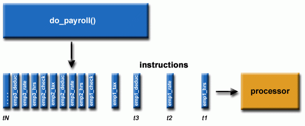

# Intro to Multithreaded Programming with POSIX Threads

Main resources:
- Content and images from 
    - [HPC Tutorials](https://hpc-tutorials.llnl.gov)
---

## Serial Computing
 

---



## Parallel Computing


---


## Concurrency vs Parallel Computing

- **Concurrency**: Operations are **concurrent** if they can progress
independently at the same time.
    - Example: A process working on multiple tasks at the same time.
- **Parallelism**: Splitting tasks into subtasks.
    - **Parallel computing:** Running subtasks (concurrent parts) in parallel on multiple processors.
---

### Matrix Addition: Concurrent Parts?
- Data: `a_ij`, `b_ij`  
- Task: Addition
- **The same task, different data!**

---


### Matrix Multiplication: Concurrent Parts?

- **Formula**: `C = AB`  
- Data: `a_i`, `B` or `A`, `b_j`  
- Task: Multiplication (and addition)  
- **The same task, different data!**

---


### Matrix Addition + Multiplication (Combined)

- **Addition**: `T = A + B`
- **Multiplication**: `C = AB`
- **Data Access**:  
    - Data: A, B 
    - Tasks: Addition, Multiplication
    - **The same data, different concurrent tasks!**

---

### Matrix Addition: Concurrent Parts?

$$
A =
\begin{bmatrix}
a_{11} & a_{12} & \dots & a_{1n} \\
a_{21} & a_{22} & \dots & a_{2n} \\
\vdots & \vdots & \ddots & \vdots \\
a_{m1} & a_{m2} & \dots & a_{mn}
\end{bmatrix}, \quad
B =
\begin{bmatrix}
b_{11} & b_{12} & \dots & b_{1n} \\
b_{21} & b_{22} & \dots & b_{2n} \\
\vdots & \vdots & \ddots & \vdots \\
b_{m1} & b_{m2} & \dots & b_{mn}
\end{bmatrix}
$$

$$
T = A + B =
\begin{bmatrix}
a_{11} + b_{11} & a_{12} + b_{12} & \dots & a_{1n} + b_{1n} \\
a_{21} + b_{21} & a_{22} + b_{22} & \dots & a_{2n} + b_{2n} \\
\vdots & \vdots & \ddots & \vdots \\
a_{m1} + b_{m1} & a_{m2} + b_{m2} & \dots & a_{mn} + b_{mn}
\end{bmatrix}
$$

---

### Matrix Addition: Data parallelism
- **Data**: `a_ij`, `b_ij`  
- **Task**: Addition  
- **Parallelism**: The same task, different data!

---

### Matrix Multiplication: Concurrent Parts?
$$
A =
\begin{bmatrix}
a_{11} & a_{12} & \dots & a_{1n} \\
a_{21} & a_{22} & \dots & a_{2n} \\
\vdots & \vdots & \ddots & \vdots \\
a_{m1} & a_{m2} & \dots & a_{mn}
\end{bmatrix}, \quad
B =
\begin{bmatrix}
b_{11} & b_{12} & \dots & b_{1p} \\
b_{21} & b_{22} & \dots & b_{2p} \\
\vdots & \vdots & \ddots & \vdots \\
b_{n1} & b_{n2} & \dots & b_{np}
\end{bmatrix}
$$

$$
C = A \cdot B =
\begin{bmatrix}
\sum_{k} a_{1k} b_{k1} & \sum_{k} a_{1k} b_{k2} & \dots & \sum_{k} a_{1k} b_{kp} \\
\sum_{k} a_{2k} b_{k1} & \sum_{k} a_{2k} b_{k2} & \dots & \sum_{k} a_{2k} b_{kp} \\
\vdots & \vdots & \ddots & \vdots \\
\sum_{k} a_{mk} b_{k1} & \sum_{k} a_{mk} b_{k2} & \dots & \sum_{k} a_{mk} b_{kp}
\end{bmatrix}
$$

---


### Matrix Multiplication: Concurrent Parts?

- **Formula**: `C = AB`  
- **Data**: `a_i`, `B` or `A`, `b_j`  
- **Task**: Multiplication (and addition)  
- **Parallelism**: The same task, different data!


---

### What if we want to do both?
Given $A$, $B$
For addition:
$$
T = A + B =
\begin{bmatrix}
a_{11} + b_{11} & a_{12} + b_{12} & \dots & a_{1n} + b_{1n} \\
a_{21} + b_{21} & a_{22} + b_{22} & \dots & a_{2n} + b_{2n} \\
\vdots & \vdots & \ddots & \vdots \\
a_{m1} + b_{m1} & a_{m2} + b_{m2} & \dots & a_{mn} + b_{mn}
\end{bmatrix}
$$

For multiplication:
$$
C = A \cdot B =
\begin{bmatrix}
\sum_{k} a_{1k} b_{k1} & \dots & \sum_{k} a_{1k} b_{kp} \\
\vdots & \ddots & \vdots \\
\sum_{k} a_{mk} b_{k1} & \dots & \sum_{k} a_{mk} b_{kp}
\end{bmatrix}
$$

---

### Matrix Addition + Multiplication (Combined)

- **Addition**: `T = A + B`
- **Multiplication**: `C = AB`
- **Data Access**:
  - **Data**: A, B  
  - **Tasks**: Addition, Multiplication
  - **Parallelism**: The same data, **different concurrent tasks**!
    - >Task-level Parallelism


---

### Explanation:
1. **Matrix Addition**:
   - Matrices `A` and `B` of dimensions `m x n` are added element-wise.
   - Independent rows/columns can be processed concurrently because the operation is local to each cell.

2. **Matrix Multiplication**:
   - Each element of `C` depends on a row of `A` and a column of `B`.
   - Computing each element can be parallelized, as it operates on separate rows and columns.

3. **Combined Operations**:
   - Addition (`T = A + B`) and multiplication (`C = AB`) are independent processes as long as matrix `A` and `B` are available, enabling task-level parallelism.

This makes the concepts of parallelism and concurrency applicable for both tasks, allowing for efficient computation on multi-threaded or distributed frameworks. 

---

## Moore’s Law and the Need for Multithreading


---

## What is a Software Thread?

- **Definition**:
    - Like processes, threads allow applications to perform multiple tasks concurrently.
    - A thread is an independent stream of instructions that can be scheduled by the OS.
- **Key Features**:
    - Threads operate concurrently and can run in parallel in multicore systems.
    - Suspending one thread does not suspend others.
    - Threads must be synchronized if execution order matters.

---

## Processes vs Threads
**Process:**
- Each process has its own virtual address space.
- Expensive to create with `fork()`.

**Thread:**
- Threads share the process’s address space but maintain:
    - Their own stack pointer, registers, scheduling property, etc.
    - Thread-specific data.
---
### Process Address Space: Processes vs Threads
<table>
  <tr>
    <td>
    
    </td>
    <td>

    </td>
  </tr>
</table>

---
<!-- Slide 9 -->
### Why Prefer Threads Over Processes?

**Processes:**
- Expensive to create:
    - **Time:** OS calls are needed.
    - **Memory:** Entire process replicated.

**Threads:**
- Lightweight:
    - Threads are created in user space with shared memory.
    - Faster communication and synchronization.
---

<!-- Slide 10 -->
### Timing of 50,000 Process/Thread Creations

| Platform                     | fork() (real) | pthread_create()(real) |
|------------------------------|---------------|--------------------------|
| Intel 2.6 GHz Xeon E5-2670   | 8.1           | 0.9                      |
| AMD 2.3 GHz Opteron          | 12.5          | 1.2                      |
| IBM 4.0 GHz POWER6           | 9.5           | 1.6                      |

---

<!-- Slide 11 -->
### Problems in Threaded Programs

- **Less Robust:** Shared data requires careful synchronization to
avoid race conditions.
- **Corruption Risk:** A misbehaving thread can corrupt shared data.
- **Cascading Failures:** If a single thread crashes, the entire
process may crash.

---

## Introduction to POSIX Threads

- **POSIX Threads (Pthreads)**:
    - Standardized C API for threading (IEEE POSIX 1003.1c).
    - Implementations include a `pthread.h` header and thread library.
- **Compiler Usage**:
    - **GCC**: `gcc -pthread`
    - **G++**: `g++ -pthread`

---

### Pthreads API Categories

1. **Thread Management**: Create, detach, join threads.
2. **Mutexes**: Synchronize via "mutual exclusion".
3. **Condition Variables**: Communication between threads sharing a mutex.
4. **Synchronization**: Manage locks and barriers.

---

<!-- Slide 14 -->
### Creating Threads
**`pthread_create` Function**
```c
#include <pthread.h>
int pthread_create(
    pthread_t *thread,               // Unique identifier for the new thread
    const pthread_attr_t *attr,      // Thread attributes (NULL for default)
    void *(*start_routine)(void *),  // Function pointer for thread execution
    void *arg                        // Argument passed to start_routine (cast to void*)
);
// Returns 0 on success, error code on failure.
```

---

### Example: Creating Threads

```c
#include <pthread.h>
pthread_t thread;
int r = pthread_create(&thread, NULL, func, &arg);
if (r != 0)
    perror("pthread_create");
```

---


### Thread Termination
A thread terminates when it
1. **returns a value**:
    ```c
    return 0; // in start function
    ```
2. **or calls `pthread_exit()`**:  
    ```c
    void pthread_exit(void *retval);// retval points to the thread's return value.
    ```
    **:warning:** `retval` should point to heap memory, not the stack.

---

### Process Termination
A multithreaded process terminates when:
- Any thread calls `exit()`.
- The `main()` function returns.
- It receives a termination signal.
- All threads call `pthread_exit()`.  

**Note:** If `main()` calls `pthread_exit()` before other threads, other threads continue execution.

---

### Example: Creating and Terminating Threads
```c
#include <pthread.h>
#include <stdio.h>
#define NUM_THREADS 5

void *printHello(void *threadid) {
    long tid = (long)threadid;
    printf("Hello! thread #%ld!\n", tid);
    pthread_exit(NULL);
}

int main() {
    pthread_t threads[NUM_THREADS];
    int rc;
    long t;
    for(t = 0; t < NUM_THREADS; t++) {
        printf("In main: creating thread %ld\n", t);
        rc = pthread_create(&threads[t], NULL, printHello, (void *)t);
        if (rc) {
            printf("ERROR; ret val: %d\n", rc);
            exit(-1);
        }
    }
    pthread_exit(NULL); // Allow other threads to continue
}
```

### Joining and Detaching Threads
`pthread_join`
- Blocks the calling thread until the specified thread finishes.  
```c
// Blocks until thread terminates
int pthread_join(pthread_t threadid, void **retval);  
```

`pthread_detach`
```c
// Reclaim resources automatically on thread exit
int pthread_detach(pthread_t thread);  
```
---


### Thread Design Considerations

- Organize the program into **independent tasks** that can execute
concurrently.
    - Shared memory: Global vs private thread data.
- Synchronize access to shared memory to avoid race conditions.

---


---


---


### Passing Arguments to Threads

**Problem**:
```c
int t;
for(t = 0; t < NUM_THREADS; t++) {
    // Passing address of shared variable 't' leads to race conditions
    rc = pthread_create(&threads[t], NULL, printHello, (void *)&t); 
}
```
**:exclamation: Issue:** The loop variable `t` is modified before threads access it.  


---

### Correct Argument Passing

**:bulb:Solution**:
```c
taskids[t] = t;
pthread_create(&threads[t], NULL, printHello, (void *)&taskids[t]);
```

---

### :bulb:Correct Approach (Using Structs)
```c
struct thread_data {
    int thread_id;
    int sum;
    char *message;
};
```

---

```c
struct thread_data thread_data_array[NUM_THREADS];

void *printHello(void *threadarg) {
    struct thread_data *my_data = (struct thread_data *)threadarg;
    // Access my_data->thread_id, my_data->sum, etc.
}

int main() {
    thread_data_array[t].thread_id = t;
    rc = pthread_create(&threads[t], NULL, printHello, (void *)&thread_data_array[t]);
}
```

---

### Miscellaneous Routines
- **Get Thread ID:**
  ```c
  pthread_t pthread_self(void);  // Returns the caller's thread ID
  ```
- **Compare Thread IDs:**
  ```c
  int pthread_equal(pthread_t t1, pthread_t t2);  // Returns non-zero if IDs match
  ```
---


## Thread Summary
- Exist within a process and share its resources.  
- Have independent control flow but share global data.  
- Require explicit synchronization for shared memory access.  
- Terminate if the parent process dies.  
- Lightweight compared to processes.  

