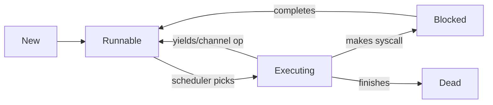

# Multi-Thread Programming-II

## Review: Concurrency & Parallelism
- **Concurrency**: Ability of program parts to execute independently without affecting the outcome.
  - Operations can progress simultaneously (e.g., a word processor handling keyboard and mouse events).
- **Parallel Computing**: Splitting tasks into subtasks executed simultaneously across multiple processors.

---

## Threads vs Processes
### Process
- Own virtual address space.
- Created via `fork()` (expensive).
- Used for security (e.g., Chrome tabs) or running separate programs (e.g., `gcc`).

### Thread
- Lightweight, shares memory with parent process.
- Managed via `pthread` library.
- Useful for multi-core systems, low overhead, and shared memory communication.

---

## Creating Threads
### `pthread_create` Syntax
```c
#include <pthread.h>
int pthread_create(
    pthread_t *thread,
    const pthread_attr_t *attr,
    void *(*start_routine)(void*),
    void *arg
);
```

---

- **Example**:
```c
pthread_t thread;
int arg = 10;
int r = pthread_create(&thread, NULL, my_func, &arg);
if (r != 0) perror("pthread_create");
```

---

## Thread Termination
A thread terminates when:
1. Its start function returns.
2. It calls `pthread_exit(retval)`.
   - `retval` must point to heap memory (not stack).

**Warning**: `exit()` terminates the entire process.

---

## Race Conditions
- Occurs when threads modify shared data concurrently.
- Example:
```c
int count = 0;
void *increment(void *n) {
    for (int j = 0; j < *(int*)n; j++) {
        count++; // Non-atomic operation (3 steps: load, increment, store)
    }
}
```
- **Result**: Undefined behavior due to interleaving.

---

## Race Condition Example: Bank Transaction
- Example scenario:
  - Thread 1 reads a balance of $1000, deposits $200, and updates to $1200.
  - Thread 2 reads the same balance of $1000, deposits $200, and updates to $1200.
  
**Result**: Incorrect final balance due to concurrent updates.

---

## Race Condition Example
### Code
```c
void *thread_main(void *p) {
    int x = *(int*)p;
    x += x;
    *(int*)p = x;
    return NULL;
}
int main() {
    int data = 1;
    pthread_t one, two;
    pthread_create(&one, NULL, thread_main, &data);
    pthread_create(&two, NULL, thread_main, &data);
    pthread_join(one, NULL);
    pthread_join(two, NULL);
    printf("%d\n", data); // Output could be 2 or 4 (race condition)
}
```

---

## Thread-Unsafe Functions
Examples: `asctime`, `strtok`, `strerror`.
- **Unsafe Code**:
```c
char *to_message(int num) {
    static char result[256]; // Shared state
    sprintf(result, "%d : blah", num);
    return result;
}
```
- **Safe Code**:
```c
int to_message_r(int num, char *buf, size_t nbytes) {
    snprintf(buf, nbytes, "%d : blah", num); // Caller-managed buffer
}
```

---

## Parallel Computation: Parallelizing Programs
- **Parallel computation** occurs at different levels:
  - Bit-level parallelism.
  - Instruction-level parallelism.
  - Data parallelism.
  - Task parallelism.

---

### Types of Parallelism
1. **Data Parallelism**: Same operation on different data (e.g., sum of array).
2. **Task Parallelism**: Different operations on same/different data (e.g., merge sort).

---

### Embarrassingly Parallel Problems
- Minimal effort to parallelize (e.g., applying a function to an array).
- Example: Parallel `map` function.
```c
int *map(int (*func)(int), int *arr, size_t len) {
    int *ret = malloc(len * sizeof(int));
    for (size_t i = 0; i < len; i++) ret[i] = func(arr[i]);
    return ret;
}
```

---

## Amdahl's Law
- Predicts theoretical speedup from parallelization.  
  Formula: 
  \[
  S_{\text{latency}}(s) = \frac{1}{(1 - p) + \frac{p}{s}}
  \]
  - \( p \): Parallel portion of the program.  
  - \( s \): Number of cores.  
  [Wikipedia](https://en.wikipedia.org/wiki/Amdahl%27s_law)

---


## 🧵 Thread Pools: Efficient Task Management  
### ⚙️ Implementation Breakdown:  
**🍔 Buffet Restaurant Analogy**  
- **Task Queue (The Buffet Line)**:  
  - Holds function pointers (dishes) waiting to be executed (eaten)  
  - FIFO structure managed with mutexes (safety tongs)  

- **Thread Pool (Chef Team)**:  
  - Pre-created worker threads (chefs)  
  - Threads sleep when queue is empty (chefs rest between rushes)  

---

- **Task Queue**:
- A queue of function pointers.
- **Thread Pool**:
  - A group of threads running a function to execute tasks from the queue.
  - If no tasks are present, threads wait.
- Requires synchronization (e.g., mutexes).

---

**🔧 Key Components**:  
```c
pthread_mutex_t lock;      // Queue protection
pthread_cond_t cond;       // Thread wake-up signal
std::queue<Task> tasks;    // Pending work items
```

**🌐 Real-world Use Case**:  
Web servers handling multiple requests simultaneously  
(Each request = task, thread pool size = server capacity)

---
 
### **C++** (Manual Example Implementation)  
```cpp  
#include <thread>  
#include <mutex>  
#include <queue>  
#include <functional>  

class ThreadPool {  
    std::vector<std::thread> workers;  
    std::queue<std::function<void()>> tasks;  
    std::mutex queue_mutex;  
    bool stop = false;  
```

---

```C++
public:  
    ThreadPool(size_t threads) {  
        for(size_t i=0; i<threads; ++i)  
            workers.emplace_back([this] {  
                while(true) {  
                    std::function<void()> task;  
                    {  
                        std::unique_lock lock(queue_mutex);  
                        while(tasks.empty() && !stop)  
                            ; // Wait logic needed  
                        if(stop) return;  
                        task = std::move(tasks.front());  
                        tasks.pop();  
                    }  
                    task();  
                }  
            });  
    }  
```

---
```c++
    void enqueue(std::function<void()> task) {  
        {  
            std::unique_lock lock(queue_mutex);  
            tasks.emplace(task);  
        }  
        // Notify worker  
    }  

    ~ThreadPool() { /* Cleanup logic */ }  
};  
```  
---

**Key Features**:  
- Manual memory management  
- Full control over queue logic  
- Requires condition variables for proper waiting  

---

### **Java** (Executor Framework)  
```java  
import java.util.concurrent.Executors;  
import java.util.concurrent.ExecutorService;  

public class Main {  
    public static void main(String[] args) {  
        ExecutorService pool = Executors.newFixedThreadPool(4);  
        for(int i=0; i<10; i++) {  
            int taskId = i;  
            pool.submit(() -> {  
                System.out.println("Executing task " + taskId +  
                                 " on " + Thread.currentThread().getName());  
            });  
        }  
        pool.shutdown();  
    }  
}  
```
---
  
**Key Features**:  
- Built-in thread pool implementations  
- Automatic task queueing  
- Future/Callable support for results  

---

### **Python** (concurrent.futures)  
```python  
from concurrent.futures import ThreadPoolExecutor  
import time  

def task(n):  
    print(f"Processing {n}")  
    time.sleep(1)  
    return n * n  

with ThreadPoolExecutor(max_workers=3) as executor:  
    # Submit tasks to the thread pool
    futures = [executor.submit(task, i) for i in range(5)]  
    # Wait for all tasks to complete
    results = [f.result() for f in futures]  

print("Results:", results)  
```  
---

**Key Features**:  
- Context manager for automatic cleanup  
- Simple future.result() blocking  
- **GIL(GIL optional after 2023) limitations for CPU-bound tasks**
-  **Python GIL Workaround**:  
   ```python  
   # Use ProcessPoolExecutor for CPU-bound work  
   from concurrent.futures import ProcessPoolExecutor  
   ``` 
   - each process has its own GIL(separate byte code, Python interpreter and memory space).
---

## Real-World Use Cases  
**C/C++**:  
- Game engines (physics calculations)  
- High-frequency trading systems  

**Java**:  
- Web servers (Tomcat request handling)  
- Batch processing systems  

**Python**:  
- Web scraping pipelines  
- API request parallelization  

---

## 💡 Pro Tips  
1. **Pool Sizing**:  
   - CPU-bound: Number of cores  
   - I/O-bound: Higher multiplier (e.g., cores × 5)  
2. **Deadlock Prevention**:  
   ```java  
   // Java example with timeout  
   Future<?> future = pool.submit(task);  
   try {  
       future.get(5, TimeUnit.SECONDS);  
   } catch (TimeoutException e) {  
       future.cancel(true);  
   }  
   ```  
 
---

---

## Python Coroutine Deep Dive  
**🔌 Generator-based Coroutines**:  
```python
def data_filter(pattern):
    print(f"Filter: {pattern}")
    while True:
        data = (yield)          # ⏸️ Pause until sent data
        if pattern in data:
            print("Match:", data)

f = data_filter("urgent")
next(f)               # ▶️ Prime the coroutine
f.send("urgent: server down")  # 🔴 Prints match
f.send("info: backup complete") # 🟢 No output
```

---

**Another example: async/await**:  
```python
async def fetch_data(url):
    print("🌐 Connecting to", url)
    await asyncio.sleep(1.5)  # Simulate network delay
    return f"📦 Data from {url}"

async def main():
    results = await asyncio.gather(
        fetch_data("api/users"),
        fetch_data("api/products"),
        fetch_data("api/orders")
    )
    print("All done!", results)
```

---

## Goroutines (Green threads in Go) 
**🌟 Key Advantages**:  
- Lightweight (2KB stack vs threads' 1MB)  
- Go language user-level thread routines.
- Stackless and managed by the Go runtime.

---
**Example**:
```go
package main
import ("fmt"; "time")

func say(s string) {
    for i := 0; i < 5; i++ {
        time.Sleep(100 * time.Millisecond) // some work
        fmt.Println(s)
    }
}
func main() {
    go say("world") // Goroutine
    say("hello")    // Main thread
}
```

---

## 🔄 Lifecycle of a Goroutine  


---

## ⚠️ Problems with Green Threads in General and Goroutines  
**1. Scheduler Complexity Overhead**  
```go
runtime.GOMAXPROCS(4) // Limited to 4 OS threads by default
for i := 0; i < 1_000; i++ {
    go cpuIntensiveTask() // May cause scheduler congestion
}
```
- **M:N Scheduling Magic**: Go runtime maps goroutines to OS threads  
- **Hidden Contention Points**:  
  - Channel operations  
  - `time.Sleep` calls  
  - Garbage collection pauses  

---

**2. Blocking Operation Trap**  
```go
go func() {
    C.callBlockingCLibrary() // 😱 Creates dedicated OS thread
}()
```
- **Syscall Surprise**: Each blocking call consumes OS thread  
- **Thread Leak**: Can exhaust system limits (~10k threads)  

---

**3. Debugging Challenges**  
```bash
WARNING: DATA RACE - concurrent map read vs write
```
- **Non-Deterministic Bugs**: Race conditions surface randomly  
- **Stack Trace Overload**: Hard to track across goroutines  

---


## 🆚 Scheduler Showdown  
| Aspect              | OS Threads           | Goroutines          |  
|---------------------|----------------------|---------------------|  
| Creation Cost       | ~1MB memory          | ~2KB memory         |  
| Switch Cost         | ~1μs (kernel mode)   | ~0.1μs (user mode)  |  
| Blocking Cost       | Thread suspended     | New OS thread spawned |  
| Max Practical       | ~10k                 | ~1M (with care)      |  


---

## Next: Synchronization
- Mutexes, semaphores, condition variables.
