# Virtual Memory & IPC

*Edited based on last year lecture slides by using DeepSeek-R1*

---

## Virtual Memory Overview
- **Early Systems**: Direct memory access (e.g., IBM 709). Processes used physical addresses like "Address 1234".
- **Modern Systems**: Use **address translation** via the **Memory Management Unit (MMU)**.
- **Key Concept**: Virtual memory abstracts physical memory, allowing isolation and efficient resource use.

---

## Address Translation
### MMU & TLB Workflow


---

### Steps in Address Translation
1. **TLB Check**: Hardware checks Translation Lookaside Buffer (TLB) for cached address.
2. **Page Table Lookup**: If TLB miss, MMU consults page table(s).
3. **Physical Address**: MMU converts virtual to physical address using page number + offset.
4. **Permission Check**: Validate read/write/execute permissions.
5. **Operation**: Perform memory access and cache result in TLB.

---

## Pages & Frames
- **Page**: Block of **virtual memory** (e.g., 4 KiB on Linux).
- **Frame**: Block of **physical memory** (same size as a page).
- **Offset**: Last 12 bits of a 32-bit address (for 4 KiB pages).

### Page Table Structure
- **32-bit System**: 
  - Total pages = \(2^{32} / 2^{12} = 2^{20}\) (1 million pages).
  - Page table size = \(2^{20} \times 4\ \text{B} = 4\ \text{MB}\).
- **64-bit System**: 
  - Total pages = \(2^{52}\) (huge! Requires multi-level tables).

---

## Multi-Level Page Tables
- **Purpose**: Reduce page table size by only allocating entries for used memory regions.
- **Trade-off**: Increased memory accesses (3 for 2-level tables vs. 2 for single-level).

---

## Translation Lookaside Buffer (TLB)
- **Role**: Cache recent virtual-to-physical page translations.
- **TLB Hit**: Fast access (1 cycle).
- **TLB Miss**: Slow path (page table walk + TLB update).

---

## MMU Algorithm (Simplified)
```python
def mmu_translate(virtual_addr):
    if tlb_hit(virtual_addr):
        physical_addr = tlb_lookup(virtual_addr)
        return physical_addr
    else:
        page_num, offset = split_address(virtual_addr)
        if page_not_in_memory(page_num):
            raise PageFault()
        if permission_denied(page_num, operation):
            raise SIGSEGV()
        physical_frame = page_table_lookup(page_num)
        tlb_update(page_num, physical_frame)
        return physical_frame + offset
```

---

## Page Faults
1. **Minor Fault**: 
   - Page not loaded but valid (e.g., `sbrk`-allocated memory). OS allocates a zero-filled page.
2. **Major Fault**: 
   - Page swapped to disk. OS retrieves it (causes thrashing if frequent).
3. **Invalid Fault**: 
   - Access to non-readable/writable memory → `SIGSEGV`.

---

## Relation to IPC
### Breaking Memory Isolation
- **Kernel-Mediated IPC**: 
  - Pipes, sockets, signals (kernel handles synchronization).
- **Shared Memory**: 
  - `mmap` maps the same physical frame to multiple processes' virtual spaces.
  - Requires explicit synchronization (e.g., semaphores).

---


---

### Key Takeaway
IPC mechanisms rely on bypassing virtual memory isolation, either via kernel APIs or shared memory mappings.

---

**Note for Students**:  
- Virtual memory concepts are foundational for understanding process isolation and IPC.  
- You’ll explore advanced topics (e.g., page replacement algorithms) in **BIL 301 OS**.  
- Experiment with `mmap` and pipes in labs to see these concepts in action! 🔍💻

---

Lecture-2

---

# IPC with mmap & Shared Memory

## Breaking Memory Isolation for IPC
Two primary methods for inter-process communication (IPC):
1. **Kernel-Mediated IPC**: Pipes, sockets, signals (managed by OS).
2. **Shared Memory**: Map same physical frame to multiple processes' virtual spaces using `mmap`.

---

## What is `mmap`?
- **Memory-mapped I/O**: Map files/devices directly into virtual memory.
- **Advantages**:
  - Bypass kernel buffer for direct file access.
  - Lazy allocation: Pages loaded on-demand via page faults.
  - Efficient sharing between processes.

### Standard I/O vs. `mmap`
```c
// Standard File I/O
char buf[100] = "merhaba";
int fd = open("hello.txt", O_WRONLY);
write(fd, buf, strlen(buf));
close(fd);

// Using mmap
char *addr = mmap(NULL, 100, PROT_WRITE, MAP_SHARED, fd, 0);
addr[0] = 'A';  // Directly modifies the file!
munmap(addr, 100);
```

---

## `mmap` Function Deep Dive
```c
#include <sys/mman.h>
void *mmap(void *addr, size_t length, int prot, int flags, int fd, off_t offset);
```

---

### Key Parameters:
| Parameter | Description |
|-----------|-------------|
| `addr`    | Start address (use `NULL` for kernel choice) |
| `length`  | Mapping size (bytes) |
| `prot`    | Access permissions: `PROT_READ`, `PROT_WRITE`, `PROT_EXEC` |
| `flags`   | `MAP_SHARED` (sync to file) or `MAP_PRIVATE` (process-local) |
| `fd`      | File descriptor (use `-1` for anonymous memory) |
| `offset`  | Page-aligned offset (multiple of `sysconf(_SC_PAGE_SIZE)`) |

---

## Shared Memory Between Processes

### 1. Parent-Child Process (Anonymous Mapping)
```c
int size = 100 * sizeof(int);
int *shared = mmap(0, size, PROT_READ | PROT_WRITE, MAP_SHARED | MAP_ANONYMOUS, -1, 0);

pid_t child = fork();
if (child > 0) {
    shared[0] = 10;  // Parent writes
} else {
    printf("%d\n", shared[0]);  // Child reads
}
munmap(shared, size);
```

---

### 2. Unrelated Processes (`shm_open`)


---

#### Example Workflow with Semaphores:
```c
// Structure for shared memory
struct shmbuf {
    sem_t sem1, sem2;
    char buf[BUF_SIZE];
    size_t cnt;
};
```

---

```c
// Process 1 (Writer)
shmp->cnt = len;
memcpy(shmp->buf, string, len);
sem_post(&shmp->sem1);  // Signal data ready

```
---

```c
// Process 2 (Reader)
sem_wait(&shmp->sem1);  // Wait for data
process_data(shmp->buf);
sem_post(&shmp->sem2);  // Signal completion
```

---

## Critical Considerations
1. **Synchronization**: Use semaphores/mutexes to prevent data races.
2. **Page Alignment**:
   ```c
   off_t offset = atoi(argv[2]);
   off_t pa_offset = offset & ~(sysconf(_SC_PAGE_SIZE) - 1);  // Align to page
   ```
3. **Cleanup**:
   - Always `munmap` and `close(fd)`.
   - Remove shared objects with `shm_unlink()`.

---

## Pros & Cons of Shared Memory
| **Pros**                          | **Cons**                          |
|-----------------------------------|-----------------------------------|
| Zero-copy (maximum speed)         | Risk of data races                |
| No disk I/O overhead              | Requires explicit synchronization|
| Flexible for large data transfers | Complex setup with `shm_open`     |

---

**Lab Tip**:  
Experiment with `mmap` to implement a producer-consumer system. Use semaphores for thread-safe operations! 🚀

---

Lecture-3

---

# IPC with Pipes

## Pipes Overview
- **Purpose**: Stream-based IPC for unidirectional byte flow (e.g., `ls | grep "txt"`).
- **Types**:
  - **Anonymous Pipes**: Short-lived, process hierarchy required (created via `pipe()`).
  - **Named Pipes (FIFOs)**: Persistent, filesystem-based (created via `mkfifo`).

---

## POSIX `pipe()` System Call
```c
#include <unistd.h>
int pipe(int pipefd[2]);  // Returns 0 on success, -1 on error
```

### Key Behavior:
- Creates two file descriptors:
  - `pipefd[0]`: Read end.
  - `pipefd[1]`: Write end.
- **Unidirectional**: Data flows from write-end to read-end.
- **Blocking**: `read()` blocks until data is available; `write()` blocks if buffer is full.

---

## Basic Pipe Workflow (Parent-Child)

```mermaid
sequenceDiagram
    Parent->>Parent: Create pipe (fd[2])
    Parent->>Child: fork()
    Parent->>fd[1]: write("Hi Child!")
    Child->>fd[0]: read() → "Hi Child!"
```


---

### Example Code:
```c
#include <unistd.h>
#include <stdio.h>

int main() {
    int fd[2];
    pipe(fd);  // Create pipe
    
    pid_t child = fork();
    if (child > 0) {       // Parent
        write(fd[1], "Hi Child!", 9);
        close(fd[1]);      // Close write end
        wait(NULL);
    } else {               // Child
        close(fd[1]);      // Close unused write end
        char buf;
        while (read(fd[0], &buf, 1) > 0) {
            putchar(buf);
        }
    }
    return 0;
}
```

---

## Critical Pipe Management
### 1. Avoiding Infinite Blocks
- **Close Unused Ends**: Always close unused pipe ends to prevent hangs.
- **SIGPIPE Handling**:
  ```c
  #include <signal.h>
  void sigpipe_handler(int sig) {
      write(1, "No readers!\n", 12);
  }
  signal(SIGPIPE, sigpipe_handler);  // Handle broken pipes
  ```

---

### 2. File Descriptor Redirection with `dup2`
```c
#include <unistd.h>
dup2(oldfd, newfd);  // Redirects newfd to oldfd

// Example: Redirect stdout to pipe write-end
dup2(pipefd[1], STDOUT_FILENO);
close(pipefd[1]);
execlp("ls", "ls", "-1", NULL);  // ls output goes to pipe
```

---

## Shell-like Piping Implementation


---

### Code: Implementing `ls | cut` with `dup2`
```c
#define _GNU_SOURCE
#include <unistd.h>
#include <fcntl.h>

int main() {
    int pipe_fds[2];
    pipe(pipe_fds);
    
    if (!fork()) {          // Child (ls)
        dup2(pipe_fds[1], STDOUT_FILENO);  // Redirect stdout to pipe
        close(pipe_fds[0]);
        execlp("ls", "ls", "-1", NULL);
    } else {                // Parent (cut)
        dup2(pipe_fds[0], STDIN_FILENO);   // Redirect stdin to pipe
        close(pipe_fds[1]);
        execlp("cut", "cut", "-f1", "-d.", NULL);
    }
    return 0;
}
```

---

## Named Pipes (FIFOs)
```c
#include <sys/stat.h>
int mkfifo(const char *pathname, mode_t mode);  // e.g., mkfifo("/tmp/myfifo", 0666);
```

### Usage:
1. **Create FIFO**:
   ```bash
   $ mkfifo /tmp/myfifo
   ```
2. **Process A (Writer)**:
   ```bash
   $ echo "Hello" > /tmp/myfifo
   ```
3. **Process B (Reader)**:
   ```bash
   $ cat < /tmp/myfifo
   ```

---

## Advanced Topics
### Non-Blocking Pipes
```c
fcntl(pipefd[0], F_SETFL, O_NONBLOCK);  // Set read-end as non-blocking
```

### Pipe Flags
```c
pipe2(pipefd, O_CLOEXEC);  // Auto-close pipe on exec
```

---

## Common Pitfalls & Solutions
| **Issue**               | **Solution**                          |
|-------------------------|---------------------------------------|
| Infinite `read()` block | Close unused write ends               |
| `SIGPIPE` crashes       | Register signal handler               |
| Data corruption         | Use synchronization (e.g., mutexes)   |

---

**Lab Challenge**:  
Implement a 3-stage pipeline (`ls → grep → wc`) using `pipe()` and `dup2`. Measure performance against shell pipelines! ⏱️🔧